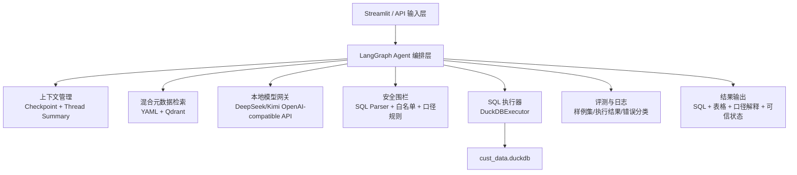
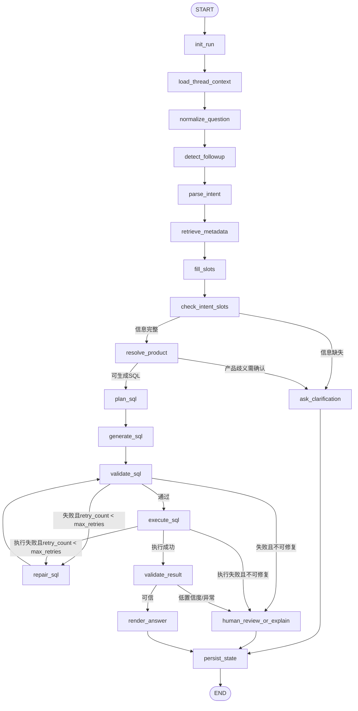
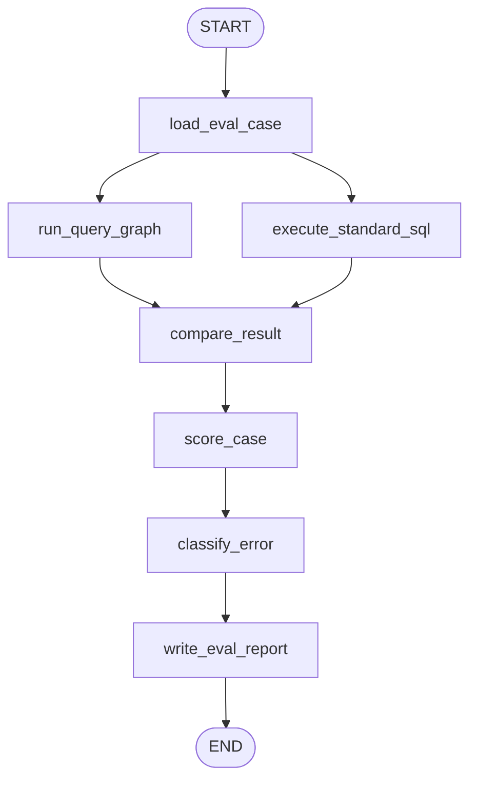

# 技术实现方案文档

> 项目：华泰证券 Agentic 智能问数在客户营销场景的应用  
> 版本：v1.6  
> 日期：2026-07-20  
> 阶段：M6 本地 Web 演示工作台实现方案

---

## 一、结论先行

本项目本质是“面向证券客户营销场景的 Text-to-SQL Agent”，不是静态 SQL 脚本集合，也不是普通 BI 页面。技术方案应围绕赛题三个攻关任务展开：

| 赛题攻关任务 | 技术落点 |
|--------------|----------|
| AI 友好元数据 | 结构化 YAML 元数据、业务术语映射、指标口径、表关系、样例 SQL 检索工具 |
| 安全围栏模块 | SQL 只读校验、表字段白名单、指标口径校验、执行前拦截、执行后结果合理性检查 |
| 取数评测流程 | 7 条样例作为评测种子，后续扩展评测集，自动执行标准 SQL 与 Agent SQL 并对比结果 |

最终选型结论：

| 层级 | 选型 | 定位 |
|------|------|------|
| Agent 编排核心 | LangGraph | 用状态图管理“意图理解 -> 元数据检索 -> SQL 生成 -> 校验 -> 执行 -> 修复 -> 输出”的可控流程 |
| LLM/工具封装 | LangChain 底层组件 | 不使用 LangChain Agent 做主流程，仅使用模型调用、Prompt、工具接口和 Retriever 适配能力 |
| Agent 形态 | 单主 Agent + 确定性工具节点 + 可选评测子 Agent | MVP 阶段避免复杂多 Agent 失控，先把取数链路做准 |
| 数据库执行层 | DuckDB | 原型阶段真实 SQL 执行引擎，后续通过 Executor 接口替换为企业数仓/PostgreSQL/ClickHouse |
| 元数据检索 | 结构化 YAML 检索 + Qdrant Local 向量检索 | 精确规则和语义召回结合，向量召回不覆盖业务口径 |
| 本地模型API | OpenAI-compatible 本地模型网关 | 接入 `deepseek-v4-rpo`、`kimi-k2.5` 等本地模型；实际 model_id 以本地 `/v1/models` 为准 |
| 上下文/记忆 | LangGraph checkpoint + 线程摘要 + 审计日志 | 模型无状态，系统托管短期会话记忆、运行时状态和长期人工确认知识 |
| 前端演示 | Streamlit 优先 | 快速演示自然语言输入、SQL、执行结果、围栏状态、评测报告 |

不建议把 HKUDS/nanobot 作为主框架。它适合研究轻量个人 Agent、聊天渠道、MCP 与长运行工作流，但本项目最关键的是金融 Text-to-SQL 的可控状态编排、SQL 安全围栏、可复现评测和真实数据库执行。LangGraph 与该目标更贴合。

---

## 二、Agent 框架选型调研

### 2.1 候选方案对比

| 方案 | 优点 | 不足 | 本项目判断 |
|------|------|------|------------|
| 手写 Pipeline | 依赖少、可完全控制、适合最早期脚本验证 | Agent 属性弱；状态、重试、人工复核、评测闭环需要自己补很多工程能力 | 可作为保底实现，不作为主方案 |
| LangChain Agent | 模型、Prompt、Tool、Retriever 生态成熟；开发快 | 高层 Agent 抽象对复杂 SQL 校验、条件分支、循环修复、人工复核的控制粒度不够直观 | 作为 LLM 与工具封装层 |
| LangGraph | 显式状态图；支持确定性节点与 LLM 节点混合；适合可控 Agent、多分支、重试、持久化、人审中断 | 比 LangChain 高层 Agent 更需要设计状态和节点 | 推荐作为主编排框架 |
| 多 Agent 框架 | 专家分工清晰，可设计元数据 Agent、SQL Agent、评测 Agent | MVP 阶段复杂度高，多个 LLM Agent 互相传话会增加不可控性和调试成本 | 暂不做全多 Agent，只保留评测子 Agent 扩展点 |
| HKUDS/nanobot | 轻量、个人 Agent、聊天渠道、工具/MCP/记忆能力丰富，适合研究和二次开发 | 不是专门为 Text-to-SQL 评测闭环设计；需要额外适配 SQL 安全、元数据检索、图式重试、评测流水线 | 作为参考，不作为主框架 |

### 2.2 为什么选择 LangGraph

本项目需要的不是“让模型自由调用工具”，而是一个强约束的取数工作流：

1. 用户问题必须先映射到业务术语和元数据。
2. SQL 生成必须只使用白名单表字段。
3. SQL 执行前必须通过只读、安全、指标口径校验。
4. 执行失败要回到 SQL 修复节点，而不是直接报错。
5. 结果异常或低置信度时要进入人工复核或解释路径。
6. 评测时要记录每个节点的输入输出，便于错误归因。

LangGraph 的状态图模型天然适合表达这种流程。每个节点负责一个明确动作，边负责条件跳转，状态对象保存问题、检索上下文、候选 SQL、校验结果、执行结果、错误历史和最终回答。这样更容易答辩，也更容易调试。

### 2.3 LangChain 的角色

LangChain 不作为主编排层，也不使用高层 LangChain Agent 自动决定工具调用顺序。它在本项目里只承担“适配器/工具箱”的角色：

- 封装本地 OpenAI-compatible 模型调用；
- 管理 Prompt Template；
- 将元数据检索器、SQL 校验器、SQL 执行器包装为 Tool；
- 接入 Qdrant Retriever；
- 需要时复用 LangChain 的输出解析、Runnable 和回调生态。

因此推荐组合是：**LangGraph 负责编排，LangChain 只负责模型、Prompt、工具和Retriever适配**。如果本地模型API与LangChain兼容性不足，可直接用 OpenAI Python SDK 或 HTTP Client 调用本地 `/v1/chat/completions`，上层 AgentGraph 不受影响。

### 2.4 多 Agent 的边界

MVP 不采用“多个自治 Agent 互相协商”的主架构。原因是金融问数更看重确定性、可审计、可评测，而不是开放式自主协作。

MVP 使用“单主 Agent + 工具节点”：

- 主 Agent：维护完整问数状态，决定下一步。
- 元数据检索节点：确定性工具，不让模型编造 schema。
- SQL 生成节点：LLM 负责生成候选 SQL。
- 围栏节点：确定性校验，模型不能绕过。
- 执行节点：真实连接数据库。
- 评测节点：离线批处理，可后续升级为评测子 Agent。

后续扩展时，可以引入有限多 Agent：

| 子 Agent | 用途 | 触发条件 |
|----------|------|----------|
| 元数据解释 Agent | 解释复杂业务术语、产品名歧义 | 用户问题包含模糊产品/指标 |
| SQL 修复 Agent | 基于错误信息修复 SQL | SQL 校验或执行失败 |
| 评测 Agent | 对生成 SQL 做语义评分和错误分类 | 批量评测或低置信度案例 |

---

## 三、总体系统架构

### 3.1 架构分层



### 3.2 MVP 核心链路

```text
自然语言问题
  -> 问题标准化
  -> 意图解析
  -> 元数据检索
  -> 槽位补全/术语映射
  -> SQL 规划
  -> SQL 生成
  -> SQL 安全围栏校验
  -> DuckDB 真实执行
  -> 结果合理性校验
  -> 生成最终回答
```

失败链路：

```text
SQL 校验失败 / 执行失败
  -> 错误归因
  -> 带错误信息重新生成 SQL
  -> 最多重试 2 次
  -> 仍失败则返回失败原因和待人工复核状态
```

---

## 四、LangGraph 状态图设计

### 4.1 设计目标

本项目的 LangGraph 不是一张概念流程图，而是后续 `agent/graph.py` 要落地的可执行状态图。它要解决四件事：

1. **流程可控**：SQL生成前必须完成上下文恢复、意图解析和元数据检索。
2. **风险可拦截**：SQL必须先过围栏，不能让模型绕过校验直接执行。
3. **失败可修复**：校验失败或执行失败后进入修复节点，并限制重试次数。
4. **过程可审计**：每个节点写入trace、context_ids、model_id、sql_hash和错误类型。

### 4.2 AgentState 状态对象

建议在 `huatai_query_agent/agent/state.py` 中定义 `AgentState`。状态字段分为输入、上下文、生成、校验、执行、输出、审计七类：

| 字段 | 含义 |
|------|------|
| `thread_id` | 会话标识，用于恢复短期记忆 |
| `query_id` | 单次查询标识，用于审计和评测 |
| `question` | 用户原始问题 |
| `normalized_question` | 标准化后的问题 |
| `is_followup` | 是否为追问或条件修改 |
| `thread_summary` | 上一轮问题、意图、SQL和口径假设摘要 |
| `intent` | 目标、维度、指标、筛选条件、时间范围、产品条件 |
| `missing_slots` | 缺失的关键信息，如时间、产品分类、统计口径 |
| `ambiguities` | 歧义项，如产品名对应多个产品 |
| `metadata_context` | 检索到的表、字段、术语、指标、关系、样例 SQL |
| `context_ids` | 本轮使用的YAML条目和Qdrant chunk id |
| `sql_plan` | SQL 生成计划，包括主表、JOIN、WHERE、GROUP BY、指标公式 |
| `candidate_sql` | 当前候选 SQL |
| `validation_report` | 只读校验、白名单校验、指标口径校验、语法校验结果 |
| `execution_result` | 数据库执行结果、行数、耗时、错误信息 |
| `result_check` | 空结果、字段匹配、异常值、低置信度检查结果 |
| `confidence` | 当前可信度评分 |
| `retry_count` | 修复重试次数 |
| `max_retries` | 最大修复次数，MVP建议为2 |
| `next_action` | 条件边路由使用的下一步动作 |
| `final_answer` | 给用户的最终回答 |
| `audit_record` | 审计字段摘要 |
| `trace` | 节点执行轨迹，用于演示和评测 |
| `slot_report` | 槽位补全、术语映射、默认假设和缺失信息 |
| `llm_intent` | LLM 意图解析节点的结构化输出、模型名和 token usage |
| `llm_slot_fill` | LLM 槽位补全节点的结构化输出 |
| `llm_plan` | LLM SQL 规划节点的结构化输出 |
| `llm_generation` | LLM SQL 生成节点的结构化输出 |
| `llm_repair` | LLM SQL 修复节点的结构化输出 |
| `result_explanation` | 结果解释的风险提示、置信度和口径说明 |

状态写入原则：

- 节点只能追加或更新自己负责的字段。
- `trace` 只追加，不覆盖。
- `metadata_context` 必须携带来源，不允许只保存裸文本。
- `execution_result` 只保存结果摘要和前N行预览，不保存完整大结果集到长期记忆。
- `retry_count` 只由 `repair_sql` 或路由节点更新。

### 4.3 节点设计

| 节点 | 类型 | 职责 |
|------|------|------|
| `init_run` | 确定性 | 创建/校验 `thread_id`、`query_id`、初始化 `max_retries` 和trace |
| `load_thread_context` | 确定性 | 从checkpoint读取上一轮摘要，判断是否存在可继承上下文 |
| `normalize_question` | 确定性 | 清洗问题、统一日期表达、识别 Q1/期初/期末等时间词 |
| `detect_followup` | 规则 + LLM | 判断是否为追问，抽取增量条件 |
| `parse_intent` | LLM + 规则 | 抽取目标、维度、指标、筛选条件、时间范围、产品名，输出结构化intent |
| `retrieve_metadata` | 混合检索 | 从 YAML + Qdrant 召回表字段、术语编码、指标口径、JOIN关系、样例SQL |
| `fill_slots` | LLM + 元数据 | 基于召回元数据补全槽位、映射术语编码、记录默认假设和缺失项 |
| `check_intent_slots` | 确定性 | 检查时间、指标、产品分类等必要槽位是否缺失 |
| `resolve_product` | 工具 | 对产品名做DuckDB候选查询和分类消歧，如“中国平安A股” |
| `plan_sql` | LLM | 生成结构化 SQL 计划，不直接执行 |
| `generate_sql` | LLM | 基于计划和元数据生成 DuckDB SQL |
| `validate_sql` | 确定性 | 校验只读、表字段白名单、禁止危险函数、指标口径、基础语法 |
| `execute_sql` | 工具 | 连接 `cust_data.duckdb` 执行 SQL 并返回结果 |
| `validate_result` | 规则 + 可选 LLM | 检查空结果、异常大结果、字段是否匹配用户问题 |
| `repair_sql` | LLM | 根据校验/执行错误修复 SQL |
| `ask_clarification` | 模板 | 缺少必要条件或产品歧义过大时，返回澄清问题 |
| `human_review_or_explain` | 模板 + 可选LLM | 低置信度时标记人工复核，解释风险 |
| `render_answer` | LLM + 模板 | 输出结果摘要、SQL、涉及口径、可信状态 |
| `persist_state` | 确定性 | 写入checkpoint摘要和审计日志 |
| `evaluate_case` | 离线节点 | 批量评测时对比标准结果并记录错误类型 |

### 4.4 完整在线状态图

在线问数主图如下，后续 `compile_query_graph()` 按这张图实现：



### 4.5 条件路由函数

LangGraph条件边建议拆成四个路由函数，避免把判断逻辑散落在节点里：

| 路由函数 | 输入字段 | 输出分支 |
|----------|----------|----------|
| `route_after_slot_check` | `missing_slots`、`ambiguities` | `ask_clarification` / `resolve_product` |
| `route_after_product_resolve` | `ambiguities.product`、候选产品数 | `ask_clarification` / `plan_sql` |
| `route_after_sql_validation` | `validation_report`、`retry_count` | `execute_sql` / `repair_sql` / `human_review_or_explain` |
| `route_after_execution` | `execution_result.error`、`retry_count` | `validate_result` / `repair_sql` / `human_review_or_explain` |
| `route_after_result_validation` | `result_check`、`confidence` | `render_answer` / `human_review_or_explain` |

核心路由规则：

```text
if 缺少必要槽位:
  ask_clarification
elif SQL校验通过:
  execute_sql
elif retry_count < max_retries and 错误可修复:
  repair_sql
else:
  human_review_or_explain
```

### 4.6 状态图伪代码

`agent/graph.py` 建议按下面的结构实现，具体API以安装版本为准：

```python
def compile_query_graph(checkpointer=None):
    graph = StateGraph(AgentState)

    graph.add_node("init_run", init_run)
    graph.add_node("load_thread_context", load_thread_context)
    graph.add_node("normalize_question", normalize_question)
    graph.add_node("detect_followup", detect_followup)
    graph.add_node("parse_intent", parse_intent)
    graph.add_node("check_intent_slots", check_intent_slots)
    graph.add_node("retrieve_metadata", retrieve_metadata)
    graph.add_node("resolve_product", resolve_product)
    graph.add_node("plan_sql", plan_sql)
    graph.add_node("generate_sql", generate_sql)
    graph.add_node("validate_sql", validate_sql)
    graph.add_node("execute_sql", execute_sql)
    graph.add_node("validate_result", validate_result)
    graph.add_node("repair_sql", repair_sql)
    graph.add_node("ask_clarification", ask_clarification)
    graph.add_node("human_review_or_explain", human_review_or_explain)
    graph.add_node("render_answer", render_answer)
    graph.add_node("persist_state", persist_state)

    graph.add_edge(START, "init_run")
    graph.add_edge("init_run", "load_thread_context")
    graph.add_edge("load_thread_context", "normalize_question")
    graph.add_edge("normalize_question", "detect_followup")
    graph.add_edge("detect_followup", "parse_intent")
    graph.add_edge("parse_intent", "check_intent_slots")

    graph.add_conditional_edges("check_intent_slots", route_after_slot_check)
    graph.add_conditional_edges("resolve_product", route_after_product_resolve)
    graph.add_conditional_edges("validate_sql", route_after_sql_validation)
    graph.add_conditional_edges("execute_sql", route_after_execution)
    graph.add_conditional_edges("validate_result", route_after_result_validation)

    graph.add_edge("retrieve_metadata", "resolve_product")
    graph.add_edge("plan_sql", "generate_sql")
    graph.add_edge("generate_sql", "validate_sql")
    graph.add_edge("repair_sql", "validate_sql")
    graph.add_edge("ask_clarification", "persist_state")
    graph.add_edge("human_review_or_explain", "persist_state")
    graph.add_edge("render_answer", "persist_state")
    graph.add_edge("persist_state", END)

    return graph.compile(checkpointer=checkpointer)
```

### 4.7 节点输入输出约定

| 节点 | 主要读取 | 主要写入 |
|------|----------|----------|
| `load_thread_context` | `thread_id` | `thread_summary`、`trace` |
| `parse_intent` | `question`、`normalized_question`、`thread_summary` | `intent`、`missing_slots`、`ambiguities` |
| `retrieve_metadata` | `intent`、`normalized_question` | `metadata_context`、`context_ids` |
| `resolve_product` | `intent.product_conditions`、`metadata_context` | `ambiguities.product`、产品候选、消歧条件 |
| `plan_sql` | `intent`、`metadata_context` | `sql_plan` |
| `generate_sql` | `sql_plan`、`metadata_context` | `candidate_sql`、`audit_record.model_id` |
| `validate_sql` | `candidate_sql`、`metadata_context` | `validation_report`、`confidence` |
| `execute_sql` | `candidate_sql` | `execution_result` |
| `validate_result` | `intent`、`execution_result` | `result_check`、`confidence` |
| `repair_sql` | `candidate_sql`、`validation_report`、`execution_result.error`、`metadata_context` | `candidate_sql`、`retry_count` |
| `render_answer` | `intent`、`candidate_sql`、`execution_result`、`metadata_context` | `final_answer` |
| `persist_state` | 全量摘要字段 | checkpoint摘要、audit日志 |

### 4.8 离线评测状态图

评测不走用户交互图，而是单独的 batch graph 或普通批处理脚本。建议流程：



评测图输出：

- 可执行率；
- 结果一致率；
- 口径一致率；
- 错误分类；
- 使用的 `context_ids`；
- 使用的 `model_id`；
- 失败节点名称。

### 4.9 Agent 可信输出原则

Agent 最终回答必须包含：

1. 查询状态：成功、失败、需人工复核。
2. 执行 SQL：完整展示，便于复核。
3. 真实结果：来自数据库执行，而不是模型编造。
4. 口径解释：引用使用到的表、字段、业务术语、指标公式。
5. 风险提示：如产品名歧义、空结果、时间口径假设。

---

## 五、上下文与记忆管理机制

### 5.1 设计原则

本项目采用“模型无状态、系统有记忆”的设计。DeepSeek/Kimi 等本地模型API每次调用只接收当前prompt，不假设模型服务保存业务会话；记忆由Agent系统显式管理。

核心原则：

1. **可控**：只有经过检索器和状态管理器筛选的上下文才能进入Prompt。
2. **可追溯**：每个上下文片段必须能追溯到YAML文件、Qdrant chunk、上一轮thread状态或执行日志。
3. **最小必要**：不把全量schema、完整历史对话、完整结果集塞给模型。
4. **防污染**：长期记忆只沉淀人工确认的业务口径、成功SQL模板和错误案例，不自动保存客户明细。
5. **可清空**：用户可以开启新thread，避免上一轮错误条件影响新查询。

### 5.2 记忆分层

| 记忆层 | 保存内容 | 存储位置 | 生命周期 | 是否进入Prompt |
|--------|----------|----------|----------|----------------|
| 静态业务记忆 | 表字段、术语编码、指标口径、表关系、样例SQL | `metadata/*.yaml` + Qdrant | 版本化长期维护 | 检索命中后进入 |
| 单次运行工作记忆 | `AgentState`中的意图、SQL计划、候选SQL、校验结果、执行结果摘要 | LangGraph运行态 | 单次请求 | 是，按节点传递 |
| thread短期记忆 | 多轮追问中的上一轮问题摘要、筛选条件、SQL摘要、口径假设 | LangGraph checkpoint，MVP可用SQLite | 一个会话/thread | 追问时进入 |
| 长期案例记忆 | 人工确认的高质量问答、标准SQL、错误修复案例 | YAML样例库 + Qdrant `example_sql` chunk | 人工审核后长期保存 | 相似问题命中后进入 |
| 审计记忆 | query_id、thread_id、模型名、上下文id、SQL hash、校验状态、耗时、结果checksum | SQLite/CSV/Markdown日志 | 演示与评测保留 | 不直接进入，调试时可查 |

### 5.3 LangGraph 状态与checkpoint

每次问数请求都携带：

```text
thread_id: 会话标识，用于恢复短期上下文
query_id: 单次查询标识，用于审计和评测
```

MVP实现建议：

| 阶段 | checkpointer | 用途 |
|------|--------------|------|
| 本地开发 | `InMemorySaver` | 快速调试，不持久化 |
| 竞赛Demo | SQLite checkpointer | 持久化thread状态，支持页面刷新后恢复 |
| 生产演进 | PostgreSQL/Redis/企业状态存储 | 多用户、多实例共享状态 |

checkpoint 中保存的是结构化状态摘要，不保存完整大结果集。执行结果只保留：

- 返回列名；
- 行数；
- 前 N 行预览；
- 结果checksum；
- 执行耗时；
- 错误信息。

### 5.4 Prompt 上下文组装顺序

每个LLM节点的Prompt由 `ContextManager` 统一组装：

```text
System安全规则
  -> 当前节点任务说明
  -> 当前用户问题
  -> thread短期摘要
  -> 精确命中的业务术语/指标口径
  -> 相关表字段和JOIN关系
  -> Qdrant召回的相似样例/业务片段
  -> 上游节点输出
```

优先级：

```text
安全规则 > 精确元数据 > SQL白名单 > 当前用户问题 > thread摘要 > 向量召回 > 相似样例
```

如果上下文冲突，以结构化YAML中的精确术语、指标和表关系为准；向量召回只作为补充，不得改写标准口径。

### 5.5 多轮追问处理

多轮追问不直接拼接全部历史对话，而是保存上一轮结构化摘要：

```yaml
last_intent:
  target: 客户列表
  filters:
    - Q1交易招商银行A股
    - Q1期末普通账户持有中国平安A股
  time_range: 20260101-20260331
last_sql_summary:
  tables: [dwd_cust_tran_d, dwd_cust_hold_d, dim_product]
  metrics: [transaction_amount]
last_assumptions:
  - Q1期末=20260331
```

用户追问“只看南京分公司”时，系统将其解析为增量过滤条件，而不是重新猜测整条需求。界面需要展示“本轮继承了哪些上一轮条件”，让用户能发现记忆污染。

### 5.6 记忆安全边界

| 风险 | 控制措施 |
|------|----------|
| 客户明细泄露到长期记忆 | 长期记忆禁止保存原始客户列表、姓名、客户号明细；只保存SQL模板和聚合摘要 |
| 上下文污染 | 每轮展示继承条件；支持清空thread；低置信度进入人工复核 |
| 向量库误召回 | Qdrant结果带source和score；SQL生成必须通过YAML白名单和围栏 |
| Prompt过长 | 控制top-k和字段范围；对历史对话做结构化摘要 |
| 审计不可追溯 | 记录query_id、thread_id、prompt_version、model_id、context_ids、sql_hash |

---

## 六、本地模型 API 方案

### 6.1 接入方式

本项目模型调用层统一按 OpenAI-compatible 接口设计，可接本地模型网关，也可接 DeepSeek 官方云 API：

```text
POST /v1/chat/completions
GET  /v1/models
```

应用层不直接依赖具体模型SDK，而是封装统一 `ModelClient`：

```python
class ModelClient:
    def chat(self, messages: list[dict], model: str, temperature: float = 0.0) -> str:
        ...
```

本地模型网关推荐配置：

```yaml
llm:
  provider: local_openai_compatible
  base_url: http://127.0.0.1:8000/v1
  api_key_env: LOCAL_LLM_API_KEY
  sql_model: deepseek-v4-rpo
  long_context_model: kimi-k2.5
  timeout_seconds: 120
  max_retries: 2
```

注意：`deepseek-v4-rpo` 和 `kimi-k2.5` 作为当前项目配置名保留；实际接入前需要以本地模型服务 `/v1/models` 返回的 `model_id` 为准，避免拼写或部署名不一致。DeepSeek官方API当前公开模型名包含 `deepseek-v4-pro` 和 `deepseek-v4-flash`，若本地部署名与官方名不同，以本地网关为准。

当前 M4 工程实现已经接入 DeepSeek 官方云 API，配置位于项目 `.env`：

```text
HUATAI_LLM_PROVIDER=deepseek
HUATAI_LLM_BASE_URL=https://api.deepseek.com
HUATAI_LLM_MODEL=deepseek-v4-pro
```

`.env` 不进入 git；`.env.example` 只保留变量模板。

### 6.2 模型路由

| 任务 | 推荐模型 | 参数建议 | 理由 |
|------|----------|----------|------|
| 意图解析 | `kimi-k2.5` 或 `deepseek-v4-rpo` | `temperature=0` | 中文业务表达理解、结构化抽取 |
| SQL规划 | `deepseek-v4-rpo` | `temperature=0` | 更偏代码和逻辑规划 |
| SQL生成 | `deepseek-v4-rpo` | `temperature=0` | 降低随机性，保证可复现 |
| SQL修复 | `deepseek-v4-rpo` | `temperature=0` | 结合错误信息做确定性修复 |
| 结果解释 | `kimi-k2.5` | `temperature=0.1` | 中文摘要和口径解释更自然 |
| 评测说明 | `kimi-k2.5` + 规则评分 | `temperature=0` | 错误分类和报告生成 |

### 6.3 Embedding 模型

Qdrant需要向量 embedding。聊天模型不一定适合作为 embedding 模型，建议单独配置本地 embedding API：

```yaml
embedding:
  provider: local_openai_compatible
  base_url: http://127.0.0.1:8001/v1
  model: bge-m3
```

如本地暂未部署embedding服务，MVP可以先使用关键词/BM25 + YAML精确检索跑通Agent，再补Qdrant向量索引。

### 6.4 健康检查

启动时必须检查：

1. 本地模型API是否可访问；
2. `/v1/models` 是否包含配置的 `sql_model` 和 `long_context_model`；
3. embedding服务是否可访问；
4. Qdrant collection是否已构建；
5. DuckDB数据库文件是否存在且8张表可查询。

---

## 七、元数据与检索方案

### 7.1 已有元数据资产

当前已建立结构化元数据目录：

```text
huatai_query_agent/metadata/
  schema_catalog.yaml
  business_terms.yaml
  metrics.yaml
  relationships.yaml
  query_examples.yaml
  README.md
```

这些文件对应赛题“AI 友好元数据”攻关任务，也是 Agent 不编造表字段和指标口径的基础。

### 7.2 检索策略

MVP 阶段采用“结构化精确检索 + Qdrant 向量检索”的混合方案，其中结构化检索负责正确性，向量检索负责近义表达和相似样例召回：

| 检索对象 | 检索方式 |
|----------|----------|
| 表字段 | YAML精确/关键词匹配 + Qdrant `table`/`field` chunk |
| 术语编码 | `business_terms.yaml` 精确/别名匹配为主，Qdrant `term` chunk 补充 |
| 指标口径 | `metrics.yaml` 精确匹配为主，Qdrant `metric` chunk 补充 |
| 表关系 | `relationships.yaml` 根据候选表确定JOIN路径 |
| 样例 SQL | Qdrant `example_sql` 语义召回 + 关键词匹配 |

上下文组装时，YAML中的精确映射优先级高于向量召回。若embedding服务暂不可用，系统可降级为YAML精确检索 + 关键词检索；但正式演示链路建议构建Qdrant Local索引。

```text
YAML 结构化检索 -> BM25/关键词检索 -> Qdrant 语义/混合检索
```

向量数据库选型详见 `04_RAG向量数据库选型调研文档.md`。

---

## 八、SQL 安全围栏设计

M4 阶段将“幻觉抑制”拆成三层，而不是只依赖 Prompt：

| 层级 | 机制 | 当前实现 |
|------|------|----------|
| 生成前约束 | LLM 节点强制 JSON 输出；Prompt 只注入 YAML/Qdrant 召回上下文、表结构、指标和关系；SQL 生成必须引用 `sql_plan` | `huatai_query_agent/llm/prompts.py`、`TextToSqlGenerator` |
| 执行前校验 | `sqlglot` 解析 DuckDB SQL；只读校验；单语句校验；表白名单；带表别名字段白名单；危险关键字拦截 | `validate_sql` 节点 |
| 执行后约束 | 真实连接 DuckDB 执行；结果解释只能基于 `execution_result` 的列、行数和预览行；失败进入修复或人工复核 | `execute_sql`、`validate_result`、`render_answer` |

因此模型即使在意图或 SQL 文本中产生幻觉，也必须经过结构化状态、元数据白名单和真实数据库执行三道关口。

### 8.1 执行前围栏

| 校验项 | 规则 |
|--------|------|
| 只读校验 | 只允许 `SELECT` / `WITH ... SELECT`，禁止 `INSERT`、`UPDATE`、`DELETE`、`DROP`、`ALTER`、`COPY` 等 |
| 单语句校验 | 不允许多条 SQL 拼接执行 |
| 表白名单 | SQL 中出现的表必须在 `schema_catalog.yaml` 中 |
| 字段白名单 | 字段必须属于对应表或 CTE 输出 |
| 指标口径 | 总资产、日均资产、交易金额、盈亏等必须符合 `metrics.yaml` |
| 时间口径 | Q1、期初、期末、客户快照日必须符合元数据文档 |
| 产品消歧 | 具体产品名尽量叠加产品分类；模糊产品名返回候选或提示风险 |

建议使用 `sqlglot` 做 SQL AST 解析，避免只靠字符串匹配。

当前代码已经实现：只读校验、单语句校验、表白名单、带表别名字段白名单、危险关键字拦截。指标公式检查仍保留为下一步增强项。

### 8.2 执行后围栏

| 校验项 | 规则 |
|--------|------|
| 行数检查 | 结果过大时只展示前 N 行，并提示导出/收窄条件 |
| 空结果检查 | 不自动改写业务条件，只解释可能原因 |
| 字段匹配 | 判断返回列是否对应用户目标，如“客户数”应返回聚合值 |
| 异常值检查 | 金额、人数等指标出现明显异常时标记低置信度 |
| 审计日志 | 记录问题、SQL、校验结果、执行耗时、错误类型 |

---

## 九、数据库执行层

### 9.1 当前数据库状态

当前已将 8 张 CSV 导入 DuckDB：

| 表名 | 记录数 |
|------|-------:|
| `ads_cust_info_d` | 500 |
| `dim_branch` | 312 |
| `dim_product` | 334,694 |
| `dim_public` | 155 |
| `dwd_cust_hold_d` | 408,150 |
| `dwd_cust_tran_d` | 39,060 |
| `dws_cust_aset_d` | 43,684 |
| `dws_cust_fin_d` | 4,892 |

数据库文件：

```text
huatai_query_agent/data/cust_data.duckdb
```

### 9.2 Executor 抽象

为了避免被 DuckDB 绑定，代码层定义统一接口：

```python
class SqlExecutor:
    def execute(self, sql: str, limit: int = 100) -> QueryResult:
        ...
```

实现类：

| 实现 | 阶段 | 说明 |
|------|------|------|
| `DuckDBExecutor` | MVP | 连接本地 `cust_data.duckdb` |
| `PostgresExecutor` | 生产备选 | 接企业服务化数据库 |
| `ClickHouseExecutor` | 大规模 OLAP 备选 | 接分析型数仓 |

---

## 十、7 条样例演示与评测

### 10.1 当前样例执行状态

已完成 DuckDB 兼容 SQL 改写，并真实连接数据库执行通过：

| 编号 | 问题摘要 | 状态 | 结果摘要 |
|------|----------|------|----------|
| q001 | 本科以上、男性、50 岁以上客户数 | 通过 | 75 人 |
| q002 | 不同年龄段客户总资产分布 | 通过 | 3 个年龄段 |
| q003 | 钻石卡男性、40 岁以上、持有比亚迪 A 股市值超 1000 的 Q1 盈亏 | 通过 | 1 人，Q1 盈亏 -661039.3890 |
| q004 | 分公司/营业部客户省市分布 | 通过 | 15 组 |
| q005 | Q1 交易招商银行 A 股且期末普通账户持有中国平安 A 股客户 | 通过 | 1 人 |
| q006 | Q1 日均资产大于 30 万且股票交易金额大于 10 万客户的持仓产品类型 | 通过 | 24 组 |
| q007 | 科创板交易金额超过 25 万客户营业部分布 | 通过 | 3 个营业部 |

说明：q003/q005 已按 `Q&A.xlsx` 原始问题修正为“比亚迪”和“招商银行”，不是早期误写的“南钢/紫金矿业”。

### 10.2 评测方法

MVP 评测先做三类分数：

| 指标 | 计算方式 |
|------|----------|
| 可执行率 | Agent 生成 SQL 能否通过围栏并成功执行 |
| 结果一致率 | Agent SQL 与标准 SQL 的结果是否一致 |
| 口径一致率 | 是否使用正确指标公式、时间口径、业务术语编码 |

错误分类：

- 表字段幻觉；
- JOIN 关系错误；
- 业务术语映射错误；
- 指标公式错误；
- 时间口径错误；
- 产品名消歧错误；
- SQL 方言错误；
- 结果字段不符合用户问题。

---

## 十一、MVP 代码目录规划

建议下一步在现有 `huatai_query_agent` 下补充 Agent 模块：

```text
huatai_query_agent/
  agent/
    __init__.py
    state.py
    graph.py
    prompts.py
    nodes/
      __init__.py
      normalize.py
      intent.py
      metadata_retrieval.py
      sql_plan.py
      sql_generation.py
      sql_guardrail.py
      sql_execution.py
      result_validation.py
      answer_rendering.py
  memory/
    __init__.py
    context_manager.py
    checkpoint_store.py
    conversation_summary.py
  models/
    __init__.py
    model_client.py
    model_router.py
    healthcheck.py
  retrieval/
    __init__.py
    chunk_builder.py
    keyword_retriever.py
    qdrant_retriever.py
    hybrid_retriever.py
    build_vector_index.py
  executors/
    __init__.py
    base.py
    duckdb_executor.py
  guardrails/
    __init__.py
    sql_parser.py
    whitelist.py
    metric_rules.py
  metadata/
    schema_catalog.yaml
    business_terms.yaml
    metrics.yaml
    relationships.yaml
    query_examples.yaml
  evaluation/
    run_demo_queries.py
    run_agent_eval.py
  sql/
    demo_queries_duckdb.sql
  vectorstore/
    qdrant/
  runtime/
    checkpoints.sqlite
    query_audit.sqlite
  app.py
  requirements.txt
```

---

## 十二、依赖规划

### 12.1 P0 依赖

```text
duckdb
PyYAML
sqlglot
pydantic
langgraph
langchain-core
openai
httpx
qdrant-client
langchain-qdrant
```

### 12.2 本地模型与Embedding可选依赖

```text
langchain-openai      # 若使用LangChain适配本地OpenAI-compatible模型
fastembed             # 若用Qdrant本地稀疏/embedding能力
sentence-transformers # 若本地运行embedding模型
```

### 12.3 按模型供应商选择

```text
langchain-openai      # OpenAI-compatible本地模型服务
langchain-deepseek    # 如后续使用 DeepSeek 官方适配
langchain-community   # 如使用部分社区工具
```

### 12.4 前端与评测可选依赖

```text
streamlit
pandas
pytest
```

---

## 十三、开发流程

### 阶段 M1：Agent 骨架

目标：先跑通 LangGraph 状态机、上下文状态和本地模型健康检查，不追求复杂生成能力。

交付：

- `AgentState`；
- LangGraph 节点和条件边；
- `ContextManager` 和 thread checkpoint；
- 本地模型 `ModelClient` 与 `/v1/models` 健康检查；
- 使用样例问题映射标准 SQL；
- 真实连接 DuckDB 执行并返回结果。

验收：

- 7 条样例都能通过 Agent 入口执行；
- 页面或命令行能展示 trace、SQL、结果。

### 阶段 M2：元数据检索工具

目标：让 Agent 不硬编码所有信息，而是从 YAML + Qdrant 检索上下文。

交付：

- schema/terms/metrics/relations/examples 加载器；
- 元数据chunk构建脚本；
- Qdrant Local索引构建脚本；
- 混合检索函数；
- 检索结果进入 `metadata_context`；
- Prompt 引用检索上下文。

验收：

- 每个样例能展示涉及表字段、业务口径和Qdrant chunk来源；
- SQL 生成输入中可看到对应元数据。

### 阶段 M3：LLM SQL 生成

目标：从“样例匹配 SQL”升级为“本地模型API自然语言生成 SQL”。

交付：

- SQL Plan Prompt；
- SQL Generation Prompt；
- 错误修复 Prompt；
- 模型路由配置，默认SQL生成走 `deepseek-v4-rpo`，解释摘要走 `kimi-k2.5`。

验收：

- 7 条样例在 LLM 生成路径下可执行；
- SQL 不通过围栏时可修复一次以上。

### 阶段 M4：多节点 LLM Agent 与安全围栏

目标：把“一次性生成 SQL”升级为可观测、可评测、可修复的多节点 Agent，并把幻觉抑制落成确定性模块。

交付：

- 独立 LLM 节点：`parse_intent`、`fill_slots`、`plan_sql`、`generate_sql`、`repair_sql`、`render_answer`；
- 每个 LLM 节点强制 JSON 输出，并写入 `AgentState` 与 `trace`；
- SQL AST 解析；
- 只读校验；
- 表白名单与带表别名字段白名单；
- 真实 DuckDB 执行后再解释结果；
- 指标公式检查；
- 危险 SQL 拦截演示案例。

验收：

- q001、q005 在 LLM 多节点路径下可执行；
- 非官方自然语言问题能走 unmatched LLM Text-to-SQL 路径；
- 编造表字段能被拦截；
- DDL/DML 能被拦截；
- 错误总资产/交易金额公式能被标记。

### 阶段 M5：自动化评测

目标：形成可量化迭代闭环。

交付：

- `run_agent_eval.py`；
- 标准 SQL 与 Agent SQL 结果对比；
- 错误分类；
- Markdown/CSV 评测报告；
- `run_guardrail_eval.py`；
- 幻觉/危险 SQL 围栏测试集。

验收：

- 可一键跑 7 条样例；
- 输出可执行率、精确结果一致率、行数一致率、列一致率；
- 输出 LLM 调用次数和 token usage；
- 输出围栏期望命中率；
- demo 模式标准样例结果一致率达到 100%；
- 幻觉/危险 SQL 围栏测试达到 100% 期望命中。

### 阶段 M6：前端演示

目标：提供答辩可演示系统。

交付：

- 本地 Web 工作台；
- 预设问题按钮；
- 自然语言输入框；
- SQL 展示；
- 结果表格；
- Agent trace；
- 围栏状态；
- 元数据召回上下文；
- 评测报告入口；
- 云端 LLM 调用风险确认。

验收：

- 评委能看到“自然语言 -> Agent 推理 -> SQL -> 真实数据库结果”的完整链路；
- 页面可在本机 `http://127.0.0.1:8501` 打开；
- demo 模式无需外部前端依赖即可运行；
- LLM 模式需要显式确认云端 API 风险。

---

## 十四、答辩表述建议

推荐表述：

> 我们没有把系统做成简单的 SQL 模板匹配，而是采用 LangGraph 构建可控 Agent 状态图。每次问数都会经过上下文恢复、意图理解、元数据/向量混合检索、SQL 规划、SQL 生成、安全围栏、数据库执行、结果校验和可信输出。LangChain 只用于模型、Prompt、工具和Retriever适配，模型调用走本地OpenAI-compatible API，DuckDB 用作原型阶段真实执行数据库。这样既能体现 Agentic 流程，又能满足金融场景对可控、可审计、可评测和数据本地化的要求。

如果被问为什么不是纯多 Agent：

> 金融问数的首要目标是准确、可解释和可复核。MVP 阶段采用单主 Agent 加确定性工具节点，能更好控制表字段、指标口径和 SQL 执行风险。多 Agent 会作为后续增强，用在 SQL 修复、元数据解释和自动评测等低风险环节。

如果被问为什么不用 nanobot：

> nanobot 是优秀的轻量通用 Agent 项目，适合个人助手、聊天渠道、MCP 工具和长运行工作流。但本项目核心是证券 Text-to-SQL 的状态化编排、安全围栏和量化评测，LangGraph 的图式控制流与持久化/人审能力更直接匹配。

如果被问上下文记忆怎么做：

> 模型本身不保存记忆，记忆由系统托管。我们用LangGraph checkpoint维护thread级短期状态，用结构化YAML和Qdrant维护业务长期记忆，用审计日志记录query级执行轨迹。长期记忆不保存客户明细，只沉淀人工确认的业务口径、SQL模板和错误案例。

---

## 十五、参考资料

- LangGraph Python Reference：`https://reference.langchain.com/python/langgraph`
- LangGraph Persistence：`https://docs.langchain.com/oss/python/langgraph/persistence`
- LangChain Agent / HITL：`https://docs.langchain.com/oss/python/langchain/human-in-the-loop`
- LangChain Chat Models：`https://docs.langchain.com/oss/python/integrations/chat`
- vLLM OpenAI-Compatible Server：`https://docs.vllm.ai/en/latest/serving/openai_compatible_server.html`
- DeepSeek API Docs：`https://api-docs.deepseek.com/zh-cn/`
- Kimi API Overview：`https://platform.kimi.ai/docs/api/overview`
- LangChain Product Overview：`https://www.langchain.com/langchain`
- LangGraph Product Overview：`https://www.langchain.com/langgraph`
- Qdrant LangChain Integration：`https://qdrant.tech/documentation/frameworks/langchain/`
- HKUDS/nanobot GitHub：`https://github.com/HKUDS/nanobot`
- DuckDB 选型调研：`03_DuckDB数据库选型调研文档.md`
- RAG 向量数据库选型调研：`04_RAG向量数据库选型调研文档.md`
- 数据流转报告：`05_Data_Stream_Report_数据流转报告.md`
- 元数据与业务术语映射：`01_元数据与业务术语映射文档.md`
