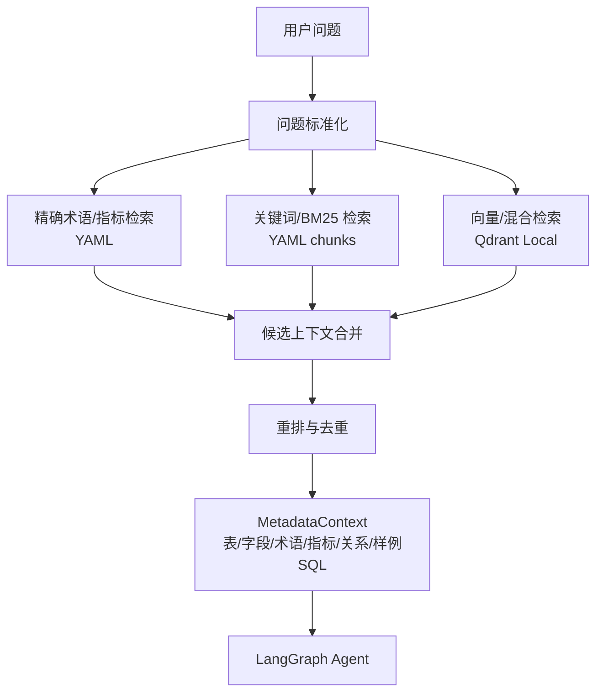

# RAG 向量数据库选型调研文档

> 项目：华泰证券 Agentic 智能问数在客户营销场景的应用  
> 版本：v1.1  
> 日期：2026-07-19  
> 结论：本项目采用“结构化元数据检索 + Qdrant Local 向量数据库”的混合RAG方案；YAML精确检索负责业务正确性，Qdrant负责语义召回和相似样例补充。

---

## 一、调研结论

本项目的 RAG 不是面向大规模非结构化文档的通用知识库，而是面向 Text-to-SQL 的“元数据增强检索”。检索对象主要包括：

- 表结构、字段中文含义；
- 业务术语和编码映射；
- 指标公式；
- 表关联关系；
- 7 条样例问答和标准 SQL。

这些知识高度结构化，且对准确性要求很高。因此不建议把向量数据库作为唯一检索入口，而是采用：

```text
结构化 YAML 精确检索 + 关键词/BM25 检索 + Qdrant 向量语义检索
```

为了体现RAG能力、支持近义表达召回和后续扩展业务文档，推荐使用 **Qdrant Local** 作为本地向量数据库：

| 阶段 | 推荐方案 | 说明 |
|------|----------|------|
| P0 最小可运行 Agent | YAML 结构化检索 + 关键词检索 + Qdrant Local | 精确规则保证正确性，向量库保证RAG演示完整性 |
| P1 RAG 增强 Demo | Qdrant Local + hybrid retrieval | 支持 metadata payload、dense/sparse/hybrid 检索、LangChain 集成 |
| P2 生产演进 | Qdrant Server / pgvector / 企业搜索平台 | 按企业基础设施、权限、审计和运维要求决定 |

最终建议：**使用Qdrant，但不要让向量库替代元数据规则；向量库只作为召回增强层。**

---

## 二、项目检索需求

### 2.1 必须满足的能力

| 需求 | 说明 |
|------|------|
| 精确术语召回 | “钻石卡”“男性”“本科以上”必须映射到稳定编码，不能只靠语义相似 |
| 表字段可解释 | 召回结果必须能说明来自哪个表、哪个字段、哪个文档 |
| 指标口径稳定 | 总资产、交易金额、盈亏等公式必须严格引用元数据 |
| 样例 SQL 召回 | 根据问题召回相似样例，辅助 SQL 规划 |
| metadata 过滤 | 能按 `chunk_type`、`table_name`、`metric_name`、`scenario` 过滤 |
| 本地可运行 | 竞赛 Demo 不应强依赖外部服务 |
| 后续可迁移 | 若生产化，需要能从本地模式平滑迁移到服务化部署 |

### 2.2 不适合只用向量检索的原因

证券 Text-to-SQL 场景里，很多关键知识不是“语义相似”问题，而是“精确口径”问题：

- “男性”必须是 `gender_cd='5000002'`；
- “本科以上”必须是 `edu_cd in ('6000002','6000003','6000004')`；
- “交易金额”必须是 `buy_amt + sell_amt`；
- “Q1期末”必须是 `20260331`；
- “中国平安A股”应叠加 `prdt_name='中国平安' and prdt_type_name='A股'`。

如果只靠向量相似度，可能召回“相近但不正确”的口径。金融问数更适合用结构化规则兜底，再用向量检索补充近义表达和样例召回。

### 2.3 与上下文/记忆管理的关系

Qdrant 中保存的是业务长期记忆的一部分，主要包括元数据chunk、样例SQL、人工确认的错误修复案例。它不保存用户会话的完整历史，也不保存DuckDB查询出的客户明细结果。

| 内容 | 是否进入Qdrant | 原因 |
|------|----------------|------|
| 表字段、指标口径、术语编码 | 是 | 用于RAG召回 |
| 标准样例SQL | 是 | 用于相似问题规划 |
| 人工确认的高质量SQL模板 | 是 | 用于长期改进 |
| 用户完整对话历史 | 否 | 属于thread短期记忆，由checkpoint保存摘要 |
| 客户查询结果明细 | 否 | 避免客户数据进入长期向量记忆 |
| 审计日志 | 否 | 单独保存在日志/SQLite中 |

---

## 三、候选方案对比

| 方案 | 优点 | 不足 | 本项目判断 |
|------|------|------|------------|
| 不使用向量库，仅 YAML + 关键词 | 最稳定、依赖少、可解释、适合当前小规模元数据 | 对近义表达和长文档召回能力弱 | P0 必做 |
| Chroma | 上手快，Python 友好，支持本地/持久化/服务模式，支持 collection 和 metadata filter | 更适合轻量 RAG Demo；混合检索和生产迁移能力不如 Qdrant 明确 | 极简备选 |
| Qdrant Local | Python client 可本地内存或磁盘持久化；同一 API 可迁移到服务模式；支持 metadata payload、dense/sparse/hybrid 检索；LangChain 集成成熟 | 比 Chroma 多一点概念成本 | 推荐 |
| LanceDB | 嵌入式，支持向量检索、全文检索和 hybrid，Arrow/Pandas 生态友好 | 本项目主要是文本元数据，不需要多模态/湖仓能力；团队熟悉成本略高 | 可作为增强备选 |
| FAISS | 高性能向量相似度检索库，适合大规模向量索引研究 | 不是完整向量数据库；metadata、持久化、过滤、文档管理要自己补 | 不推荐作为主 RAG 存储 |
| Milvus / Milvus Lite | 功能强，生产扩展能力好，适合大规模向量检索 | 对当前元数据规模过重；Milvus Lite 官方本地环境更偏 Linux/macOS，Windows Demo 不占优 | 生产级备选，不用于当前 MVP |
| pgvector | 直接把向量放进 PostgreSQL，ACID、JOIN、权限和备份能力强 | 需要 PostgreSQL 环境；本地竞赛 Demo 部署成本高 | 生产化有 PostgreSQL 时优先考虑 |
| Elasticsearch / OpenSearch | 关键词 + 向量 + 过滤 + 聚合能力强，企业搜索成熟 | 部署重，对当前项目过度工程 | 企业已有搜索平台时考虑 |

---

## 四、为什么推荐 Qdrant Local

### 4.1 更适合“语义 + 精确过滤”混合场景

本项目 RAG chunk 会带大量结构化 metadata，例如：

```yaml
chunk_type: metric
metric_name: transaction_amount
table_name: dwd_cust_tran_d
scenario: 交易分析
source_file: metrics.yaml
```

问数 Agent 检索时常需要先限定范围再召回，例如：

- 只搜指标口径；
- 只搜产品相关规则；
- 只搜涉及 `dwd_cust_tran_d` 的表字段；
- 只搜样例 SQL。

Qdrant 的 payload 过滤和 LangChain 集成可以很好支持这类用法。

### 4.2 支持本地模式，也有服务化迁移路径

Qdrant Python client 支持：

```python
QdrantClient(":memory:")
QdrantClient(path="huatai_query_agent/vectorstore/qdrant")
QdrantClient(host="localhost", port=6333)
```

这意味着 MVP 可以先不启动任何服务，直接本地持久化；后续如果需要服务化或多人访问，只需要切换连接参数和部署模式，Retriever 的上层接口可以保持稳定。

### 4.3 混合检索能力有利于中文金融术语

Text-to-SQL 元数据检索既需要语义召回，也需要关键词/稀疏召回：

- “一季度”和“2026年Q1”是语义/规则等价；
- “cust_lvl_cd”“钻石卡”“1000001”需要精确召回；
- “交易金额”必须召回 `buy_amt + sell_amt`，不能被“买入金额”单独替代。

Qdrant 的 LangChain 集成支持 dense、sparse、hybrid 三种检索模式，适合后续把向量召回与关键词召回合并。

---

## 五、推荐 RAG 架构

### 5.1 检索链路



### 5.2 Chunk 设计

| chunk_type | 来源 | 内容 |
|------------|------|------|
| `table` | `schema_catalog.yaml` | 表名、中文名、业务含义、使用场景 |
| `field` | `schema_catalog.yaml` | 字段名、中文名、类型、说明、关联 |
| `term` | `business_terms.yaml` | 业务术语、别名、编码、SQL 条件 |
| `metric` | `metrics.yaml` | 指标名称、公式、涉及表、注意事项 |
| `relationship` | `relationships.yaml` | 表关联键、JOIN 类型、适用场景 |
| `example_sql` | `query_examples.yaml` + SQL 文件 | 样例问题、意图、涉及表、标准 SQL 摘要 |

### 5.3 Chunk metadata

每条向量记录至少保存：

```yaml
id: metric.transaction_amount
chunk_type: metric
source_file: metrics.yaml
table_name: dwd_cust_tran_d
field_name: null
metric_name: transaction_amount
scenario: 交易分析
version: "1.0"
text: "交易金额 = sum(coalesce(buy_amt,0)+coalesce(sell_amt,0)) ..."
```

### 5.4 召回策略

| 查询类型 | 主召回方式 | 辅助召回 |
|----------|------------|----------|
| 编码术语 | YAML 精确匹配 | Qdrant term chunk |
| 指标口径 | YAML 精确匹配 | Qdrant metric chunk |
| 表字段选择 | 关键词/BM25 | Qdrant table/field chunk |
| 相似样例 SQL | Qdrant example_sql | 关键词/BM25 |
| 产品名消歧 | SQL 查询 `dim_product` | Qdrant 产品规则 chunk |

---

## 六、本地模型与Embedding方案

### 6.1 Embedding接口

Qdrant存储向量需要embedding模型。本项目使用本地部署模型API，因此embedding也建议本地部署，接口尽量保持 OpenAI-compatible：

```yaml
embedding:
  provider: local_openai_compatible
  base_url: http://127.0.0.1:8001/v1
  model: bge-m3
```

如本地embedding服务暂时未准备好，系统可以先构建关键词检索和YAML精确检索，Qdrant索引脚本保留；但正式演示建议补齐embedding服务，否则“向量数据库”只能停留在架构说明层面。

### 6.2 Chat模型与检索分工

`deepseek-v4-rpo`、`kimi-k2.5` 这类本地聊天模型负责意图解析、SQL规划、SQL生成、修复和结果解释；embedding模型负责把元数据chunk转成向量。不要用聊天completion结果替代embedding。

| 组件 | 推荐模型/API | 职责 |
|------|--------------|------|
| SQL生成模型 | `deepseek-v4-rpo` | SQL计划、SQL生成、SQL修复 |
| 长上下文/解释模型 | `kimi-k2.5` | 意图解释、结果摘要、报告生成 |
| Embedding模型 | `bge-m3` 或本地等价embedding服务 | 元数据chunk向量化 |
| Vector DB | Qdrant Local | 保存向量、payload metadata、召回chunk |

---

## 七、代码落地建议

### 7.1 目录结构

```text
huatai_query_agent/
  retrieval/
    __init__.py
    chunk_builder.py
    keyword_retriever.py
    qdrant_retriever.py
    hybrid_retriever.py
    build_vector_index.py
  vectorstore/
    qdrant/
```

### 7.2 依赖

P0 基础依赖：

```text
PyYAML
qdrant-client
langchain-qdrant
```

如需本地稀疏检索或本地 embedding，可再评估：

```text
fastembed
sentence-transformers
```

embedding 模型不建议写死在架构里，应通过配置切换：

```yaml
embedding:
  provider: openai_compatible
  model: text-embedding-3-small
vectorstore:
  provider: qdrant
  mode: local
  path: huatai_query_agent/vectorstore/qdrant
```

---

## 八、最终建议

当前项目建议这样推进：

1. M1/M2 同时完成 YAML 精确检索、关键词检索和Qdrant Local索引，保证7条样例稳定。
2. LangGraph 中的 `retrieve_metadata` 节点调用 `HybridMetadataRetriever`，返回统一 `MetadataContext`。
3. 向量召回结果必须带来源和 metadata，不能只把一段文本塞给模型。
4. SQL生成必须以YAML精确术语、指标和表字段白名单为准，不能被向量召回覆盖。
5. 生产化时再按部署环境选择 Qdrant Server、pgvector 或企业搜索平台。

答辩表述：

> 本项目没有把 RAG 简化为“向量库相似度搜索”。证券问数中的表字段、指标口径和业务编码必须精确可控，因此我们采用结构化元数据检索作为主通道，Qdrant向量数据库作为语义召回增强。MVP 阶段即构建Qdrant Local索引，同时保留YAML精确规则兜底；这样既能展示RAG能力，又能避免向量召回误导SQL生成。

---

## 九、参考资料

- Chroma Getting Started：`https://docs.trychroma.com/docs/overview/getting-started`
- Chroma Metadata Filtering：`https://docs.trychroma.com/docs/querying-collections/metadata-filtering`
- Qdrant Python Client：`https://github.com/qdrant/qdrant-client`
- Qdrant LangChain Integration：`https://qdrant.tech/documentation/frameworks/langchain/`
- Qdrant Local Mode：`https://qdrant.tech/documentation/frameworks/langchain/`
- Qdrant Payload：`https://qdrant.tech/documentation/manage-data/payload/`
- Qdrant Filtering：`https://qdrant.tech/documentation/search/filtering/`
- Kimi API Overview：`https://platform.kimi.ai/docs/api/overview`
- DeepSeek API Docs：`https://api-docs.deepseek.com/zh-cn/`
- LanceDB Python API：`https://lancedb.github.io/lancedb/python/python/`
- FAISS Documentation：`https://faiss.ai/`
- Milvus Lite：`https://milvus.io/docs/milvus_lite.md`
- pgvector：`https://github.com/pgvector/pgvector`
- Elasticsearch Vector Search：`https://www.elastic.co/docs/solutions/search/vector`
