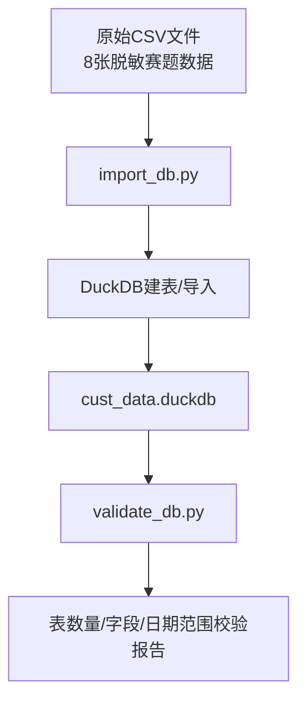
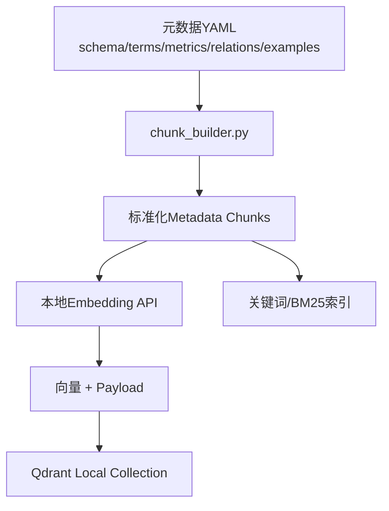
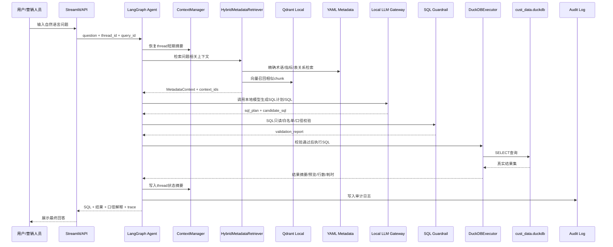
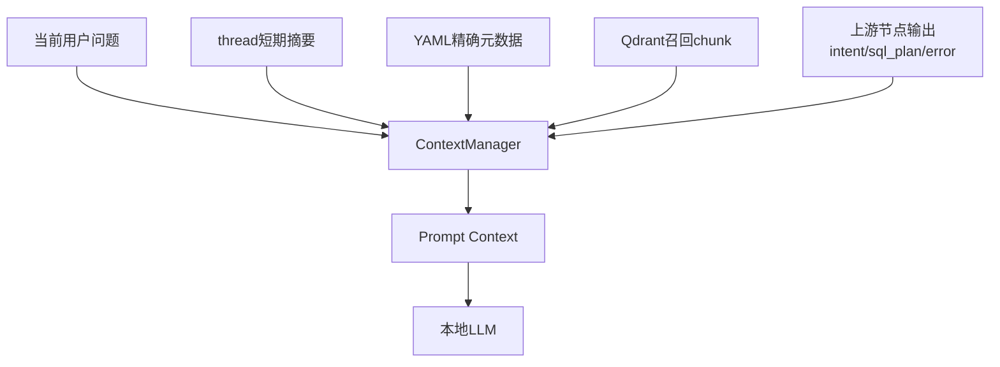
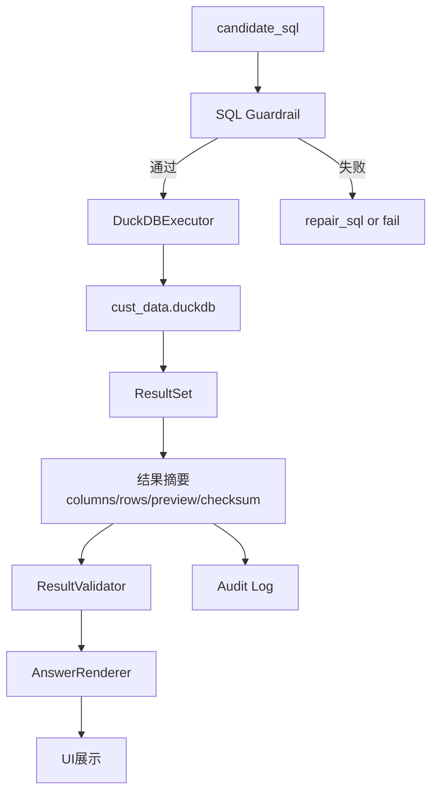
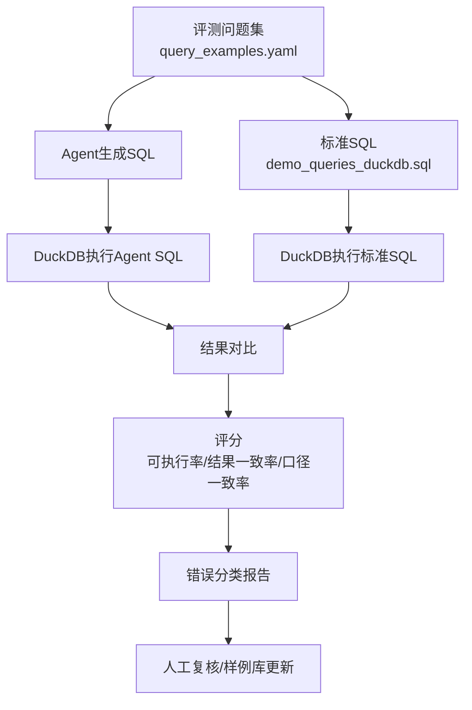

# Data Stream Report 数据流转报告

> 项目：华泰证券 Agentic 智能问数在客户营销场景的应用  
> 版本：v1.0  
> 日期：2026-07-19  
> 用途：说明系统从原始数据、元数据、向量库、Agent上下文、本地模型API到最终结果输出的完整数据流转、存储边界和审计链路。

---

## 一、总体结论

本项目包含三条核心数据流：

| 数据流 | 触发时机 | 核心目标 |
|--------|----------|----------|
| 离线数据准备流 | 系统初始化/数据更新时 | 将CSV导入DuckDB，将元数据构建为YAML和Qdrant向量索引 |
| 在线问数执行流 | 用户每次提问时 | 通过LangGraph Agent恢复上下文、检索元数据、调用本地模型生成SQL、执行并返回真实结果 |
| 离线评测流 | 版本迭代/演示前 | 批量运行样例问题，对比标准SQL和Agent SQL，输出准确率与错误类型 |

数据安全原则：

- 业务明细数据只进入DuckDB执行层和结果展示层；
- Qdrant只保存元数据chunk、样例SQL和人工确认模板，不保存客户明细结果；
- LangGraph checkpoint只保存thread短期状态摘要，不保存完整大结果集；
- 审计日志记录SQL、上下文来源、模型信息、校验结果和结果checksum，默认不保存客户明细。

---

## 二、离线数据准备流

### 2.1 原始业务数据入库



输入文件：

| 文件 | 目标表 |
|------|--------|
| `ads_cust_info_d_202606031625.csv` | `ads_cust_info_d` |
| `dim_branch_202606021048.csv` | `dim_branch` |
| `dim_product_202606021049.csv` | `dim_product` |
| `dim_public_202606021050.csv` | `dim_public` |
| `dwd_cust_hold_d_202606021051.csv` | `dwd_cust_hold_d` |
| `dwd_cust_tran_d_202606021051.csv` | `dwd_cust_tran_d` |
| `dws_cust_aset_d_202606021051.csv` | `dws_cust_aset_d` |
| `dws_cust_fin_d_202606021050.csv` | `dws_cust_fin_d` |

输出：

```text
huatai_query_agent/data/cust_data.duckdb
```

### 2.2 元数据入索引



元数据来源：

| 来源 | 用途 |
|------|------|
| `01_元数据与业务术语映射文档.md` | 人可读业务口径总文档 |
| `metadata/schema_catalog.yaml` | 表字段知识 |
| `metadata/business_terms.yaml` | 术语与编码映射 |
| `metadata/metrics.yaml` | 指标公式 |
| `metadata/relationships.yaml` | 表关系 |
| `metadata/query_examples.yaml` | 样例问答结构化拆解 |
| `sql/demo_queries_duckdb.sql` | 标准可执行SQL |

Qdrant payload 示例：

```yaml
id: metric.transaction_amount
chunk_type: metric
source_file: metrics.yaml
metric_name: transaction_amount
table_name: dwd_cust_tran_d
version: "1.0"
text: "交易金额 = sum(coalesce(buy_amt,0)+coalesce(sell_amt,0))"
```

---

## 三、在线问数执行流

### 3.1 主流程



### 3.2 关键数据对象

| 对象 | 生成节点 | 内容 | 存储位置 |
|------|----------|------|----------|
| `thread_id` | UI/API | 会话标识 | 前端session + checkpoint |
| `query_id` | UI/API | 单次查询标识 | 审计日志 |
| `AgentState` | LangGraph | 问题、意图、上下文、SQL、校验、结果摘要 | 运行时 + checkpoint摘要 |
| `MetadataContext` | HybridRetriever | 表、字段、术语、指标、JOIN、样例SQL、chunk id | 运行时 |
| `candidate_sql` | LLM节点 | 候选SQL | 运行时 + 审计 |
| `validation_report` | Guardrail | 只读、白名单、口径、语法校验结果 | 运行时 + 审计 |
| `execution_result` | DuckDBExecutor | 行数、列名、前N行、耗时、错误 | 运行时 + 前端 |
| `final_answer` | AnswerRenderer | 用户可读回答 | 前端 + 可选日志 |

### 3.3 本地模型调用流

```text
LangGraph节点
  -> ModelRouter
  -> ModelClient
  -> 本地OpenAI-compatible API
  -> deepseek-v4-rpo / kimi-k2.5
```

模型分工：

| 节点 | 默认模型 | 输入 | 输出 |
|------|----------|------|------|
| `parse_intent` | `kimi-k2.5` | 用户问题 + thread摘要 | 结构化意图 |
| `plan_sql` | `deepseek-v4-rpo` | 意图 + MetadataContext | SQL计划 |
| `generate_sql` | `deepseek-v4-rpo` | SQL计划 + 表字段/口径 | 候选SQL |
| `repair_sql` | `deepseek-v4-rpo` | 错误信息 + 原SQL + 元数据 | 修复SQL |
| `render_answer` | `kimi-k2.5` | SQL + 结果摘要 + 口径 | 中文解释 |

所有模型调用都记录：

- `model_id`；
- `base_url`所属环境，不记录API key；
- `prompt_version`；
- `context_ids`；
- token/耗时信息；
- 成功/失败状态。

---

## 四、上下文与记忆流

### 4.1 上下文来源



Prompt上下文优先级：

```text
安全规则 > 精确术语/指标口径 > 表字段白名单 > 当前用户问题 > thread摘要 > Qdrant召回 > 相似样例
```

### 4.2 记忆写入规则

| 写入对象 | 写入内容 | 是否自动写入 | 审核要求 |
|----------|----------|--------------|----------|
| thread checkpoint | 当前会话摘要、上一轮意图、上一轮SQL摘要、错误状态 | 是 | 不需要 |
| query audit | query_id、SQL、模型、上下文id、校验结果、耗时、checksum | 是 | 不需要 |
| Qdrant长期记忆 | 新增样例SQL、修复案例、业务口径说明 | 否 | 需要人工确认 |
| YAML元数据 | 新增术语、指标、表关系 | 否 | 需要人工维护 |

### 4.3 不写入长期记忆的数据

以下内容不得写入Qdrant或长期案例库：

- 客户姓名；
- 客户号明细列表；
- 完整查询结果表；
- 未脱敏个人画像；
- 用户临时输入中包含的敏感业务信息；
- 模型生成但未通过校验的SQL模板。

---

## 五、SQL执行与结果回传流



结果回传策略：

| 场景 | 回传方式 |
|------|----------|
| 聚合统计 | 展示完整聚合结果 |
| 客户列表 | 默认只展示前N行，必要时脱敏 |
| 大结果集 | 展示行数、列名、前N行和导出提示 |
| 空结果 | 返回可执行SQL和筛选条件解释，不自动放宽条件 |
| 执行失败 | 返回错误归因，进入SQL修复节点 |

---

## 六、离线评测流



评测输出：

| 字段 | 说明 |
|------|------|
| `case_id` | 样例编号 |
| `question` | 用户问题 |
| `agent_sql` | Agent生成SQL |
| `standard_sql` | 标准SQL |
| `executable` | 是否可执行 |
| `result_match` | 结果是否一致 |
| `metric_match` | 口径是否一致 |
| `error_type` | 错误分类 |
| `context_ids` | 使用的元数据/向量chunk |
| `model_id` | 使用的本地模型 |

---

## 七、存储与数据资产清单

| 资产 | 路径/位置 | 内容 | 是否可删除重建 |
|------|-----------|------|----------------|
| 原始CSV | `原始文件/*.csv` | 赛题脱敏原始数据 | 否，应保留 |
| DuckDB数据库 | `huatai_query_agent/data/cust_data.duckdb` | 导入后的8张业务表 | 是，可由CSV重建 |
| 元数据YAML | `huatai_query_agent/metadata/*.yaml` | 结构化元数据 | 否，人工维护 |
| 标准SQL | `huatai_query_agent/sql/demo_queries_duckdb.sql` | 7条标准SQL | 否，人工确认 |
| Qdrant索引 | `huatai_query_agent/vectorstore/qdrant/` | 元数据向量索引 | 是，可由YAML和embedding重建 |
| Checkpoint | `huatai_query_agent/runtime/checkpoints.sqlite` | thread短期状态 | 可清理 |
| 审计日志 | `huatai_query_agent/runtime/query_audit.sqlite` | 查询轨迹和校验记录 | 演示/评测期保留 |
| 评测报告 | `huatai_query_agent/evaluation/*.md|*.csv` | 批量评测结果 | 可重跑生成 |

---

## 八、审计字段设计

每次查询建议记录：

```yaml
query_id: qrun_20260719_000001
thread_id: demo_thread_001
created_at: "2026-07-19T20:30:00+08:00"
question: "2026年Q1交易过招商银行A股..."
model_id:
  intent: kimi-k2.5
  sql: deepseek-v4-rpo
prompt_version: "sql_generation_v1"
context_ids:
  - term.gender.male
  - metric.transaction_amount
  - example_sql.q005
candidate_sql_hash: "sha256:..."
validation_status: passed
execution_status: success
row_count: 1
result_checksum: "sha256:..."
elapsed_ms: 820
confidence: 0.93
```

审计日志用于定位问题，不作为模型长期学习数据。只有人工确认后的案例才进入长期样例库和Qdrant。

---

## 九、异常与降级流

| 异常 | 降级策略 |
|------|----------|
| 本地LLM服务不可用 | 健康检查失败，返回模型服务不可用；预设样例可走标准SQL演示 |
| 配置的model_id不存在 | 调用 `/v1/models` 提示可用模型名，阻止执行 |
| embedding服务不可用 | 暂停Qdrant重建，在线检索降级为YAML + 关键词 |
| Qdrant collection不存在 | 提示先运行索引构建脚本 |
| SQL校验失败 | 进入修复节点，最多重试2次 |
| SQL执行失败 | 带DuckDB错误信息进入修复节点 |
| 结果为空 | 展示SQL和筛选条件，不自动放宽条件 |
| 上下文冲突 | 以YAML精确口径为准，标记向量召回冲突 |

---

## 十、端到端数据流摘要

```text
原始CSV
  -> DuckDB导入
  -> cust_data.duckdb

元数据文档/YAML/标准SQL
  -> chunk构建
  -> 本地embedding
  -> Qdrant Local

用户问题
  -> LangGraph AgentState
  -> ContextManager恢复thread摘要
  -> HybridRetriever检索YAML + Qdrant
  -> 本地DeepSeek/Kimi模型API生成SQL
  -> SQL Guardrail校验
  -> DuckDBExecutor执行
  -> ResultValidator校验
  -> AnswerRenderer生成解释
  -> UI展示 + checkpoint摘要 + audit日志

评测问题集
  -> Agent SQL与标准SQL双路执行
  -> 结果对比
  -> 评测报告
  -> 人工确认后更新样例库/Qdrant
```

---

## 十一、参考文档

- `00_PRD_产品需求文档.md`
- `01_元数据与业务术语映射文档.md`
- `02_技术实现方案文档.md`
- `03_DuckDB数据库选型调研文档.md`
- `04_RAG向量数据库选型调研文档.md`
