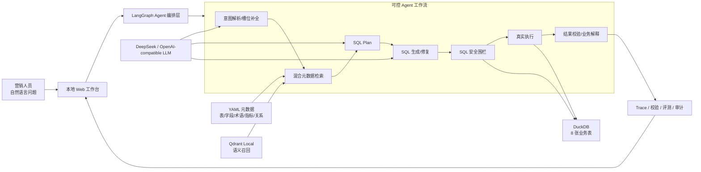
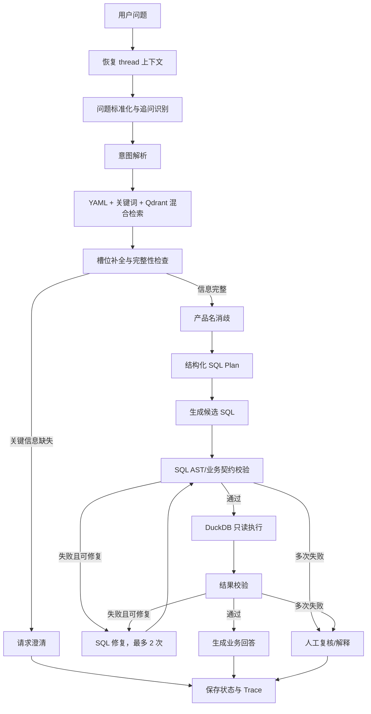
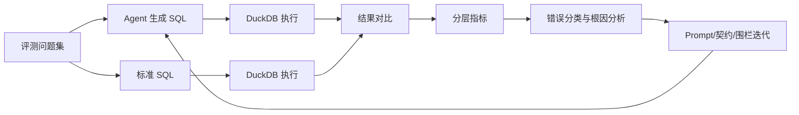

# 华泰证券 Agentic 智能问数项目——PPT 汇报项目文档

> 项目方向：金融大模型与智能体赛道——Agentic 智能问数在客户营销场景的应用  
> 文档用途：项目汇报、PPT 制作、现场答辩与 Demo 讲解  
> 文档版本：v1.0  
> 整理日期：2026-08-01  
> 当前阶段：M6 可演示 MVP，处于 LLM 泛化能力与工程稳定性持续优化阶段

---

## 0. 使用说明

这份文档分为三部分：

1. **项目全景说明**：用于统一团队对项目背景、方案、技术和成绩的表述。
2. **PPT 逐页文案**：提供 14 页推荐结构，可直接复制到幻灯片。
3. **演示与答辩附录**：包括 5—8 分钟演示流程、常见问题、指标口径和答辩前检查项。

文档中的结果分为三类，请在汇报时严格区分：

- **当前现场核验结果**：2026-08-01 在当前工作区重新执行得到。
- **归档评测结果**：仓库现有评测报告中记录的历史完整运行结果。
- **业务目标**：产品希望达到的目标，不等于当前已经实现的成绩。

---

# 第一部分：项目全景说明

## 1. 项目摘要

### 1.1 一句话介绍

本项目构建了一套面向证券客户营销场景的 **Agentic Text-to-SQL 智能问数系统**：营销人员用自然语言描述客户圈选或经营分析需求，系统通过可控的 Agent 工作流完成意图理解、元数据检索、SQL 规划与生成、安全校验、真实数据库执行、结果验证和业务解释。

### 1.2 核心定位

项目不是一个静态 SQL 模板库，也不是只展示结果的 BI 页面，而是一套强调以下四项能力的智能问数原型：

- **可执行**：连接本地 DuckDB，返回真实数据库结果，而不是模拟回答。
- **可控**：通过 LangGraph 显式编排问数流程，关键步骤由状态和条件路由控制。
- **可审计**：展示 SQL、元数据来源、执行轨迹、校验状态和错误原因。
- **可评测**：使用标准 SQL 与 Agent SQL 双路执行，量化可执行率、结果一致性和错误类型。

### 1.3 项目价值主张

传统证券营销取数通常需要经历“业务描述需求—数据人员理解口径—编写 SQL—反复确认—交付结果”的流程。本项目把业务语言、企业元数据、指标口径和数据库执行连接起来，目标是将高频、碎片化取数从人工协作转化为分钟级自助问数，同时保留金融场景必须具备的安全、审计与人工复核能力。

### 1.4 当前交付概览

| 维度 | 当前交付 |
|---|---|
| 数据底座 | 8 张脱敏业务表导入 DuckDB，现场校验共 831,447 行 |
| 元数据底座 | 表、字段、术语、指标、时间口径、关系和样例 SQL 共构建 150 个检索 chunk |
| Agent 编排 | LangGraph 状态图，代码定义 19 个功能节点及多条修复、澄清、人工复核分支 |
| 模型接入 | 支持 DeepSeek/OpenAI-compatible LLM，可切换云端 API 或本地模型网关 |
| 安全围栏 | 只读、多语句、危险关键字、表字段白名单、快照日期、指标公式等校验 |
| 执行引擎 | DuckDB 只读连接，真实执行生成 SQL |
| 评测体系 | 官方、扩展、合成、高级四层用例，共 81 道完整 LLM 评测资产 |
| 展示端 | 本地 Web 工作台，展示结果、SQL、Trace、围栏、元数据与评测报告 |

---

## 2. 项目背景与业务痛点

### 2.1 业务场景

证券客户营销人员需要频繁围绕客户画像、资产、交易、持仓、产品和营业部进行分析，例如：

- 学历本科以上、男性且年龄超过 50 岁的客户有多少？
- 不同年龄段客户的总资产如何分布？
- 哪些客户在一季度交易过招商银行 A 股，同时在季末持有中国平安 A 股？
- 科创板交易金额超过 25 万元的客户分布在哪些营业部？

这些问题通常具有三个特点：条件组合多、业务口径强、需求变化快。

### 2.2 传统方式的主要问题

| 痛点 | 具体表现 | 业务影响 |
|---|---|---|
| 取数门槛高 | 业务人员需要理解表结构、字段和 SQL | 取数仍高度依赖技术人员 |
| 响应链路长 | 需求需要多轮沟通和排期 | 营销机会响应不及时 |
| 口径容易漂移 | “总资产”“交易金额”“区间盈亏”等可能有不同理解 | 结果难复核、部门间不一致 |
| 即时需求难覆盖 | 固化报表难以处理临时组合条件 | 大量碎片化需求回流数据团队 |
| 大模型结果不可信 | 可能编造表、字段、关联关系或指标 | 直接执行存在安全与业务风险 |
| 缺少量化评测 | 只展示成功案例，无法判断版本真实能力 | 难以做工程迭代和回归验收 |

### 2.3 项目要解决的三个核心问题

1. **企业私有知识如何被模型准确理解**：把业务术语、编码、指标、表关系和时间口径变成 AI 可检索的结构化元数据。
2. **如何抑制幻觉并提供可信输出**：在生成前、执行前和执行后设置确定性约束与安全围栏。
3. **如何工程化衡量智能取数质量**：建立从标准答案、批量执行、分层指标到错误归因的自动化评测闭环。

---

## 3. 产品目标与用户

### 3.1 产品目标

构建一套可运行、可演示、可解释、可评测的证券营销 Text-to-SQL Agent，跑通：

```text
自然语言问题
  -> 意图和槽位理解
  -> 企业元数据检索
  -> SQL 计划与生成
  -> 安全围栏
  -> 真实数据库执行
  -> 结果验证与解释
  -> 自动评测与持续改进
```

### 3.2 目标用户

| 用户 | 主要需求 | 系统价值 |
|---|---|---|
| 客户营销人员 | 客户圈选、资产分析、产品持仓和营业部分布 | 用自然语言提出需求，降低取数门槛 |
| 数据分析/运营人员 | 复核 SQL、统一口径、沉淀高频查询 | 减少重复开发并提高复用性 |
| 数据治理人员 | 维护元数据、指标和表关系 | 将治理规则直接转化为 Agent 约束 |
| 审计/技术人员 | 查看执行轨迹、校验结果和错误原因 | 提高系统透明度和可追责性 |

### 3.3 业务目标与当前状态的边界

- **业务目标**：将常见营销取数从人工协作缩短到秒级或分钟级，并逐步达到工业可用准确率。
- **当前状态**：已完成可演示 MVP 和全链路工程闭环；官方样例稳定路径已经跑通，开放式 LLM 泛化能力仍需继续提高。

---

## 4. 总体解决方案

### 4.1 总体架构



### 4.2 架构分层

| 层级 | 主要组件 | 作用 |
|---|---|---|
| 交互展示层 | Python 标准库 HTTP Server + 原生 HTML/CSS/JS | 提问、样例选择、结果展示和技术细节查看 |
| Agent 编排层 | LangGraph | 管理状态、节点顺序、条件路由、修复和人工复核 |
| 模型能力层 | DeepSeek/OpenAI-compatible API | 意图解析、槽位补全、SQL 计划、生成与结果解释 |
| 知识检索层 | 结构化 YAML + 关键词检索 + Qdrant Local | 提供业务术语、字段、指标、关系和相似样例 |
| 安全与契约层 | sqlglot AST + 业务契约校验 | 控制只读、合法字段、快照、指标公式和输出契约 |
| 数据执行层 | DuckDBExecutor | 以只读连接执行 SQL，返回真实结果与耗时 |
| 评测审计层 | 标准 SQL、评测集、Markdown/CSV 报告 | 进行批量回归、结果对比和错误归因 |

### 4.3 技术选型理由

| 技术 | 选择理由 | 后续扩展 |
|---|---|---|
| LangGraph | 用状态图显式控制流程，适合金融场景的审计、重试和人工复核 | 可增加 checkpoint 持久化和更多低风险子 Agent |
| DuckDB | 适合本地原型，可直接承载 CSV 数据并执行真实 SQL | Executor 接口可替换为企业数仓、PostgreSQL 或 ClickHouse |
| YAML 元数据 | 人可读、可版本管理、便于规则维护 | 可与企业数据目录和指标平台同步 |
| Qdrant Local | 支持本地语义召回，减少对外部服务依赖 | 生产环境可切换 Qdrant Server 解决并发访问 |
| sqlglot | 可解析 SQL AST，比字符串规则更适合表、字段和语句级校验 | 可继续增强 CTE 血缘、方言转换和契约验证 |
| OpenAI-compatible API | 解耦具体模型供应商 | 可切换 DeepSeek、Kimi 或企业本地模型 |

---

## 5. Agent 工作流

### 5.1 主流程



### 5.2 为什么是“单主 Agent + 确定性节点”

项目没有为了形式而堆叠多个自由自治 Agent。MVP 采用单主 Agent 管理状态，检索、校验、执行、结果比较等环节使用确定性工具节点，主要考虑：

- 金融问数更重视准确、可控和可复现，而不是自由探索。
- 每个节点的输入、输出、错误和路由都可以被 Trace 记录。
- 出现错误时能够明确判断是意图、检索、SQL、围栏还是结果问题。
- 后续仅在 SQL 修复、评测归因等低风险位置引入子 Agent，更容易控制成本和风险。

### 5.3 上下文和记忆

- 使用 `thread_id` 维护短期会话摘要，支持一次追问或条件修改。
- LLM 按无状态调用设计，系统决定哪些信息进入 Prompt。
- Prompt 上下文优先级为：安全规则 > 精确业务口径 > 表字段白名单 > 当前问题 > thread 摘要 > 向量召回 > 相似样例。
- 长期知识只接收人工确认的业务口径和成功模板，不保存客户明细结果。

---

## 6. 核心能力一：AI 友好元数据

### 6.1 元数据资产

系统把散落在数据库和业务文档中的知识整理为五类结构化 YAML：

| 元数据文件 | 内容 | 在 Agent 中的作用 |
|---|---|---|
| `schema_catalog.yaml` | 8 张表、68 个字段、中文释义、类型和数据日期范围 | 表字段召回、白名单和快照校验 |
| `business_terms.yaml` | 业务术语、别名、编码和组合条件 | 将“男性”“本科以上”“钻石卡”等映射到字段条件 |
| `metrics.yaml` | 指标公式和时间口径 | 约束总资产、交易金额、资金流和盈亏计算 |
| `relationships.yaml` | 表关系、关联键和 JOIN 模板 | 支持复杂多表查询 |
| `query_examples.yaml` | 7 条官方样例的结构化拆解 | 相似问题召回、演示入口和评测种子 |

### 6.2 已核验的元数据 chunk

| Chunk 类型 | 数量 |
|---|---:|
| 表 | 8 |
| 字段 | 68 |
| 业务术语 | 40 |
| 指标 | 11 |
| 时间口径 | 4 |
| 表关系 | 12 |
| 样例 SQL | 7 |
| **合计** | **150** |

### 6.3 混合检索策略

系统不是只依赖向量相似度，而是合并：

1. 结构化 YAML 精确匹配；
2. 关键词匹配；
3. Qdrant 语义召回；
4. 结果去重和重排。

精确术语和指标口径优先于相似样例，避免语义相似但业务口径错误的内容覆盖治理规则。

### 6.4 典型口径示例

| 业务概念 | 结构化口径 |
|---|---|
| 客户总资产 | `nm_tot_aset + fc_pur_aset` |
| 日均资产 | 实际快照总资产的平均值；标准样例口径按题目和数据日期确定 |
| 交易金额 | `buy_amt + sell_amt` |
| 资金流入 | `cash_in + tran_in + assign_in` |
| 资金流出 | `cash_out + tran_out + assign_out` |
| 区间盈亏 | 期末资产 − 期初资产 + 资金流出 − 资金流入 |
| 2026 年 Q1 | `20260101`—`20260331` |
| 客户画像快照 | `20260531` |

---

## 7. 核心能力二：安全围栏与可信输出

### 7.1 三层幻觉抑制

| 阶段 | 机制 | 作用 |
|---|---|---|
| 生成前 | 结构化元数据、SQL Plan、JSON 输出约束 | 减少模型自由编造空间 |
| 执行前 | sqlglot AST、只读校验、单语句校验、表字段白名单、指标和快照契约 | 阻止危险或业务口径错误的 SQL 进入数据库 |
| 执行后 | 真实 DuckDB 结果、结果契约、置信度和人工复核路由 | 防止模型脱离数据库结果自由解释 |

### 7.2 当前校验范围

- 只允许 `SELECT` 或 `WITH ... SELECT`。
- 禁止 `INSERT`、`UPDATE`、`DELETE`、`DROP`、`COPY`、`PRAGMA` 等危险操作。
- 拦截多语句拼接。
- 校验表名和字段名是否存在。
- 校验静态表快照日期和事实表日期范围。
- 校验关键指标公式，例如总资产必须包含普通和信用账户资产。
- 校验输出列、列顺序、别名语义和必要字段。
- 校验 Top N、窗口分区、资格条件、缺失事实策略和多事实表聚合关系。
- 校验失败时最多修复两次，仍失败则进入人工复核，不强行返回答案。

### 7.3 围栏评测口径

仓库归档报告记录 10 个围栏用例全部符合预期，包括危险语句、编造表、编造字段、多语句和错误指标公式。

2026-08-01 对当前未提交工作区复跑时结果为 **9/10**。唯一未匹配项是正向用例：

```sql
select count(*) as customer_count from ads_cust_info_d
```

当前更严格的快照政策要求客户画像表必须带 `data_dt='20260531'`，因此该用例被拦截。这一差异属于**围栏规则已收紧、测试用例未同步更新的契约漂移**，不是危险 SQL 被放行。答辩前应更新安全正例并重新生成报告。

---

## 8. 核心能力三：自动化评测闭环

### 8.1 评测流程



### 8.2 评测资产

| 用例集 | 数量 | 主要目的 |
|---|---:|---|
| 官方样例 | 7 | 验证比赛规定场景与演示闭环 |
| 扩展变体 | 14 | 验证同义表达、条件变化和口径复用 |
| 合成用例 | 30 | 扩展常见客户营销问数组合 |
| 高级用例 | 30 | 验证窗口、复杂时间、多事实表和复杂输出契约 |
| **合计** | **81** | 从演示可用到泛化能力的分层评测 |

### 8.3 评测指标

- Agent 是否完整执行完成；
- 候选 SQL 是否可执行；
- 输出字段数量和字段语义是否一致；
- 行数是否一致；
- 有序/无序结果值是否一致；
- 是否满足指标、快照、缺失事实、窗口和 JOIN 契约；
- 错误类型、模型调用次数、Token、执行耗时和 Trace。

这种分层评测避免只用“SQL 字符串完全一致”衡量结果，因为不同 SQL 可能业务等价；同时也避免只看“能执行”，因为可执行不代表业务口径正确。

---

## 9. 数据底座与场景覆盖

### 9.1 现场核验的数据规模

2026-08-01 执行 `validate_db.py`，8 张表全部通过表结构和记录数校验：

| 表 | 业务主题 | 行数 |
|---|---|---:|
| `ads_cust_info_d` | 客户画像 | 500 |
| `dim_branch` | 分公司与营业部 | 312 |
| `dim_product` | 产品信息 | 334,694 |
| `dim_public` | 公共字典 | 155 |
| `dwd_cust_hold_d` | 客户持仓 | 408,150 |
| `dwd_cust_tran_d` | 客户交易 | 39,060 |
| `dws_cust_aset_d` | 客户资产 | 43,684 |
| `dws_cust_fin_d` | 资金流入流出 | 4,892 |
| **合计** |  | **831,447** |

数据库文件约 80.5 MB，DuckDB 以只读方式连接。现场校验同时确认：客户总数 500、Q1 资产日期覆盖 2026-01-01 至 2026-03-31，共 90 个快照日，产品关联查询可正常执行。

### 9.2 七个官方场景

| ID | 场景 | 业务难点 | 归档标准结果摘要 |
|---|---|---|---|
| q001 | 多条件客户圈选 | 学历、性别、年龄编码映射 | 客户数 75 |
| q002 | 年龄段资产分布 | 分段、资产公式、聚合 | 返回 3 个年龄段 |
| q003 | 持仓与区间盈亏 | 多表、多期资产、资金流口径 | 符合条件客户 1 人 |
| q004 | 客户地域与机构分布 | 组织与客户地域关联 | 返回 15 组 |
| q005 | 交易与持仓交叉筛选 | 交易区间、期末持仓、产品消歧 | 返回客户 1 人 |
| q006 | 资产与交易筛选后的产品分布 | 多层筛选、持仓分类汇总 | 返回 24 组 |
| q007 | 科创板客户营业部分布 | 产品分类、交易额、机构聚合 | 返回 3 个营业部 |

---

## 10. 当前结果与客观解读

### 10.1 稳定 Demo 基线

仓库归档的 Demo 模式报告显示：

| 指标 | 结果 |
|---|---:|
| 官方样例候选 SQL 可执行率 | 7/7，100% |
| 官方样例严格结果匹配率 | 7/7，100% |
| 官方样例行数匹配率 | 7/7，100% |

这里的 Demo 模式使用经过确认的标准样例路径，证明系统的数据、编排、围栏、执行和展示闭环稳定，不应被表述为开放式自然语言泛化准确率。

### 10.2 最近一次完整 LLM 归档评测

模型：`deepseek-v4-pro`；用例数：81；LLM 调用 360 次；总 Token 2,302,907；总运行时间约 2 小时 23 分钟。

| 指标 | 全部 81 题 | 官方 7 题 | 扩展 14 题 | 合成 30 题 | 高级 30 题 |
|---|---:|---:|---:|---:|---:|
| 候选 SQL 可执行率 | 83.95% | 100% | 100% | 96.67% | 60% |
| 行数匹配率 | 74.07% | 100% | 85.71% | 90% | 46.67% |
| 严格结果匹配率 | 6.17% | 14.29% | 7.14% | 10% | 0% |

### 10.3 如何正确解释这些数据

完整 LLM 评测表明，系统生成可执行 SQL 的能力已具备基础，但复杂业务口径和严格输出契约仍是主要瓶颈：

- 51 题被归类为字段不匹配，部分是别名或列顺序差异，部分是真实漏列。
- 13 题因槽位检查过于保守进入澄清路径，没有生成 SQL。
- 高级用例在快照、窗口、Top N、缺失事实和多事实表聚合方面更容易漂移。
- 旧评测器的严格匹配会把部分业务等价但别名不同的结果判错，因此不能只看单一 Exact 指标。

当前工作区已经加入更完整的输出契约、快照、窗口、JOIN 和缺失事实策略校验。现场单元测试中 **29 个契约测试全部通过**；但尚未形成同口径的 81 题完整回归报告，因此答辩中应把它表述为“已完成针对性工程改进，待完整回归确认”，不能直接宣称准确率已经提升。

### 10.4 项目最值得强调的成绩

1. 不是只展示成功案例，而是建立了 81 题、四层难度的真实 LLM 评测资产。
2. 能明确区分“可执行”“字段契约”“行数”“值匹配”和“端到端完成”。
3. 对失败进行了可定位的根因拆解，并把改进落到结构化契约和确定性校验，而不是只更换更大模型。
4. 官方场景从数据、元数据、Agent、围栏、执行到 Web 展示形成了完整可演示闭环。

---

## 11. Web 演示工作台

当前 Web 工作台使用 Python 标准库 `ThreadingHTTPServer` 和原生 HTML/CSS/JS，无需 Node.js 或前端构建步骤。

页面可展示：

- Demo/LLM 两种模式；
- 七个官方样例和自定义问题；
- 最终回答与真实结果预览；
- SQL Plan 和候选 SQL；
- LangGraph 节点 Trace；
- SQL 围栏和结果校验；
- 元数据 context IDs 与召回 chunk；
- Agent 和围栏评测报告。

这种设计便于答辩时同时向评委展示“业务结果”和“系统为什么可信”。

---

## 12. 项目创新点

### 创新点一：从“表结构提示”升级为可治理的企业语义层

系统不仅向模型提供 DDL，而是把业务术语、编码、指标公式、时间口径、JOIN 关系和样例 SQL 统一为结构化元数据，并结合精确检索和向量召回，让企业私有知识能够被版本管理、审计和持续维护。

### 创新点二：把大模型生成放进可控状态机

意图、检索、槽位、计划、生成、校验、执行、修复和解释都被拆为显式节点；LLM 不直接拥有数据库自由执行权，所有 SQL 必须经过确定性围栏。

### 创新点三：把业务规则变成可执行契约

除只读和表字段白名单外，系统进一步校验输出列、指标公式、快照、缺失事实、窗口和多表聚合关系，使“业务口径”从文档说明转化为机器可执行规则。

### 创新点四：用失败驱动工程迭代

项目保留完整 LLM 调用、结果和错误分类，通过 81 题分层评测发现槽位阻断、字段契约、快照和 CTE 校验问题，再针对性升级 Agent 和评测器，形成可重复的迭代闭环。

### 创新点五：双路径兼顾现场稳定与真实能力

- Demo 路径用于稳定复现官方场景和保证现场演示。
- LLM 路径用于评估真实自然语言泛化能力。

二者口径明确分离，既保证演示可靠，又避免用模板结果冒充模型泛化能力。

---

## 13. 安全、隐私与工程边界

### 13.1 数据安全原则

- DuckDB 只读连接，SQL 执行前必须经过围栏。
- Qdrant 只保存元数据和人工确认的样例，不保存客户明细结果。
- thread 记忆只保存意图、SQL 摘要和状态，不沉淀完整客户列表。
- 审计日志记录 SQL、上下文来源、模型、校验状态、耗时和结果摘要，不记录 API Key。
- 云端 LLM 模式需要用户显式确认；生产金融环境建议使用本地模型网关。

### 13.2 当前边界

本期为竞赛 MVP，不包含：

- 真实证券生产系统接入；
- 多用户和行列级权限体系；
- 大规模并发和容灾；
- 投资建议或交易下单；
- 客户隐私明文展示。

---

## 14. 风险、问题与下一步

| 优先级 | 当前问题 | 影响 | 建议动作 |
|---|---|---|---|
| P0 | 收紧快照规则后，围栏安全正例未同步 | 当前复跑为 9/10 | 给正例增加客户快照条件，重跑并更新报告 |
| P0 | 当前 Web 进程占用 Qdrant Local 锁 | 无法同时运行 Web 与本地评测进程 | 答辩时串行运行；后续切换 Qdrant Server 或独立只读索引实例 |
| P0 | 契约增强后尚未完成 81 题同口径回归 | 无法量化最新改进效果 | 固定模型、Prompt、版本和评测参数后完整重跑 |
| P0 | 高级 LLM 用例成功率不足 | 复杂开放式问题可用性有限 | 优先优化槽位阻断、输出契约、快照和窗口逻辑 |
| P1 | 当前 thread 记忆主要为进程内摘要 | 服务重启后状态丢失 | 接入 LangGraph checkpoint/SQLite 持久化 |
| P1 | 原型执行层为单机 DuckDB | 不代表生产数仓性能和权限 | 通过 Executor 接入企业数仓和权限体系 |
| P1 | 评测成本较高 | 完整运行耗时和 Token 较大 | 建立 smoke、回归和完整评测三级流水线 |
| P2 | 结果图表与导出能力有限 | 业务展示不够直观 | 增加自动图表、CSV/Excel 导出和查询历史 |

### 14.1 推荐迭代路线

1. **答辩稳定性**：修复围栏测试契约、固化环境、准备 Demo 录屏和截图。
2. **能力回归**：运行最新 81 题完整评测，生成新旧版本对比。
3. **检索与并发**：把 Qdrant Local 改为 Server 模式，支持 Web 与评测并行。
4. **生产适配**：接入企业本地模型、统一权限、脱敏和查询审计。
5. **业务闭环**：增加查询历史、结果导出、营销人群包和人工确认反馈。

---

## 15. 项目总结

本项目完成了一个证券客户营销智能问数 MVP 的完整工程闭环：

- 用结构化元数据承载企业私有知识；
- 用 LangGraph 将 LLM 推理放入可控状态机；
- 用 sqlglot 和业务契约约束 SQL；
- 用 DuckDB 返回真实数据结果；
- 用 Trace、围栏和评测报告提供可解释性；
- 用 81 题分层评测暴露真实问题并驱动迭代。

项目当前最核心的成果不是“所有自然语言问题都已准确回答”，而是建立了一条从业务问题到可信 SQL、从真实执行到量化评测的可扩展技术路径，为后续接入企业数仓、本地模型和权限体系提供了工程基础。

---

# 第二部分：PPT 逐页文案

以下推荐结构为 **14 页、8—10 分钟汇报**。如果现场只有 5 分钟，可保留第 1、2、3、5、6、7、8、10、12、14 页。

## 第 1 页：封面

**标题**

> 华泰证券 Agentic 智能问数  
> 面向客户营销场景的可控、可审计、可评测 Text-to-SQL Agent

**副标题**

> 金融大模型与智能体赛道｜项目汇报

**视觉建议**

使用“业务人员自然语言提问 → Agent → 数据库 → 客户洞察”的简洁链路图。背景建议采用深色金融蓝，配合青绿色数据流高亮。

**讲解要点**

> 我们做的不是一个普通聊天机器人，而是一套面向证券客户营销取数的 Agent 系统。它能够把自然语言需求转化为经过业务口径和安全规则校验的 SQL，并在真实数据库上执行。

---

## 第 2 页：项目一句话与成果总览

**页面标题**

> 让营销人员用自然语言完成可信取数

**核心文案**

> 自然语言问题经过意图理解、企业元数据检索、SQL 规划、安全围栏和真实执行后，返回可解释、可复核的业务结果。

**四个成果卡片**

- 8 张业务表、831,447 行真实数据；
- 150 个 AI 友好元数据 chunk；
- 19 个 Agent 功能节点与修复/复核分支；
- 81 道分层 LLM 评测资产。

**讲解要点**

> 项目已经完成从数据、知识、Agent、围栏、执行到评测和 Web 展示的闭环。我们的重点不是单点模型能力，而是整个问数系统的可信工程化。

---

## 第 3 页：业务痛点

**页面标题**

> 固化报表不够灵活，自助 BI 仍有技术门槛

**三列内容**

1. **业务侧**：临时需求多、组合条件复杂、等待时间长。
2. **数据侧**：重复写 SQL、反复确认口径、难以规模化复用。
3. **大模型侧**：可能编造表字段、口径漂移、缺少可量化评测。

**结论句**

> 金融问数真正的难点不是“生成一段 SQL”，而是理解企业语义并保证执行结果可信。

---

## 第 4 页：目标与攻关问题

**页面标题**

> 围绕三项核心问题构建可信问数 Agent

| 攻关问题 | 项目回答 |
|---|---|
| 企业私有知识如何被模型理解？ | 结构化 YAML + 关键词 + Qdrant 混合检索 |
| 如何抑制幻觉和错误 SQL？ | SQL Plan + AST 围栏 + 业务契约 + 真实执行 |
| 如何衡量系统是否可用？ | 标准 SQL/Agent SQL 双路执行 + 81 题分层评测 |

**讲解要点**

> 我们把赛题要求落成了三项可运行模块，而不是停留在概念设计。

---

## 第 5 页：总体架构

**页面标题**

> 从自然语言到真实数据结果的端到端架构

**建议画面**

将本文件“4.1 总体架构”的 Mermaid 图重绘为六层架构：

```text
Web 交互层
   ↓
LangGraph Agent 编排层
   ↓
企业元数据与 LLM 能力层
   ↓
SQL 安全与业务契约层
   ↓
DuckDB 真实执行层
   ↓
Trace、审计与评测层
```

**右侧标签**

> 可控｜可解释｜可替换｜可扩展

---

## 第 6 页：Agent 工作流

**页面标题**

> LLM 不直接执行 SQL，每一步都经过显式状态和条件路由

**主链路**

```text
问题标准化 → 意图解析 → 元数据检索 → 槽位补全
→ SQL Plan → SQL 生成 → 安全校验 → 真实执行
→ 结果校验 → 业务解释
```

**异常分支**

- 信息不足：请求澄清；
- 产品名模糊：候选消歧；
- SQL 或结果失败：最多修复两次；
- 仍不可信：进入人工复核。

**讲解要点**

> 这也是我们选择 LangGraph 而不是自由自治 Agent 的原因：金融问数必须知道模型在什么状态、为何执行、为何拒绝。

---

## 第 7 页：AI 友好元数据

**页面标题**

> 把企业业务知识变成 Agent 可检索、可约束的语义层

**数字卡片**

> 8 张表｜68 个字段｜40 个术语｜11 个指标｜12 个关系｜7 个样例

**示例链路**

```text
“本科以上男性客户”
  → 本科以上 = edu_cd IN (...)
  → 男性 = gender_cd = '5000002'
  → 客户画像快照 = data_dt = '20260531'
```

**结论句**

> 精确业务规则优先，向量召回只做补充，避免“语义相似但口径错误”。

---

## 第 8 页：安全围栏

**页面标题**

> 三层机制抑制幻觉，SQL 通过围栏后才能进入数据库

**三层盾牌图**

1. **生成前**：结构化上下文 + SQL Plan + JSON 约束；
2. **执行前**：只读、多语句、表字段、快照、指标、输出契约；
3. **执行后**：真实结果验证 + 置信度 + 人工复核。

**拦截示例**

```sql
delete from ads_cust_info_d where 1=1;
select * from hallucinated_customer_table;
select fake_col from ads_cust_info_d;
```

**讲解要点**

> 我们不把“防幻觉”寄托在 Prompt 上，而是把关键规则变成确定性代码。

---

## 第 9 页：典型业务场景

**页面标题**

> 从简单圈选到多表交叉分析

建议选三个难度递进的场景：

1. **基础圈选**：本科以上、男性、50 岁以上客户数；
2. **多表交叉筛选**：Q1 交易招商银行 A 股且期末持有中国平安 A 股的客户；
3. **综合指标计算**：钻石卡男性、持有比亚迪且市值超过阈值的客户 Q1 盈亏。

**视觉建议**

每个场景用“问题—涉及表—关键口径—结果”四格卡片展示。

---

## 第 10 页：评测体系与结果

**页面标题**

> 不只展示成功案例，用 81 题评测真实能力边界

**左侧：评测金字塔**

```text
高级 30
合成 30
扩展 14
官方 7
```

**右侧：两类成绩分开呈现**

- 稳定 Demo 基线：官方 7 题严格结果匹配 7/7；
- 完整 LLM 归档评测：候选 SQL 可执行率 83.95%，行数匹配率 74.07%。

**页脚说明**

> 严格 Exact 为 6.17%，主要暴露输出列契约、槽位阻断和复杂口径问题；当前已加入针对性契约改进，待完整回归确认。

**讲解要点**

> 我们主动展示模型的真实边界，因为评测体系和持续改进能力本身就是项目的重要成果。

---

## 第 11 页：从失败到工程改进

**页面标题**

> 失败不是黑盒：每类问题都能定位到具体节点和契约

| 评测发现 | 工程改进 |
|---|---|
| 完整问题被过度澄清 | 区分阻断缺失、假设和非阻断不确定项 |
| 漏列、别名和列顺序不稳定 | 增加完整输出列契约和 AST 投影校验 |
| 快照和缺失事实策略漂移 | 增加表级快照与 missing fact policy |
| Top N、窗口分区错误 | 增加 window/eligibility 结构化契约 |
| CTE 合法字段被误杀 | 增加 CTE scope 与 projection 校验 |

**结果标签**

> 当前 29 个契约单元测试全部通过；最新 81 题回归待执行。

---

## 第 12 页：Web Demo

**页面标题**

> 一套页面同时展示业务结果与技术可信度

**建议截图区域**

1. 自然语言输入和样例选择；
2. 查询结果表格；
3. SQL Plan 与候选 SQL；
4. LangGraph Trace；
5. 围栏、元数据和评测报告。

**讲解要点**

> 对业务人员，页面给出结果；对数据和审计人员，页面给出 SQL、依据和执行路径。

---

## 第 13 页：创新点与业务价值

**页面标题**

> 从“模型生成 SQL”升级为“可信智能问数工程”

**创新点**

- 企业语义层：结构化元数据 + 混合检索；
- 可控 Agent：状态图 + 条件路由 + 人工复核；
- 业务契约：从安全规则延伸到指标、快照和输出；
- 量化闭环：81 题评测驱动持续迭代。

**预期业务价值**

- 降低营销人员取数门槛；
- 减少数据团队重复 SQL 开发；
- 统一指标和时间口径；
- 缩短高频需求响应时间；
- 为企业数仓与本地模型接入提供统一 Agent 层。

注意：业务价值为上线后的预期效果，当前竞赛 MVP 尚未进行真实生产业务量化。

---

## 第 14 页：总结与路线图

**页面标题**

> 已完成可信问数闭环，下一步走向泛化与生产化

**已完成**

- 真实数据与 DuckDB 执行；
- AI 友好元数据和混合检索；
- LangGraph 多节点 Agent；
- SQL 围栏和业务契约；
- 自动化评测与 Web 工作台。

**下一步**

- 完成契约增强后的 81 题回归；
- Qdrant Server 化，支持并发和服务化；
- 接入企业本地模型、数仓和权限体系；
- 增加图表、导出、历史与人工反馈闭环。

**收束句**

> 我们交付的不只是一套 Demo，而是一条从企业业务语言到可信数据结果的可扩展工程路径。

---

# 第三部分：演示与答辩附录

## 16. 5—8 分钟现场演示脚本

### 16.1 演示前检查

```powershell
cd "E:\HKUST\农行杯\01-金融大模型与智能体赛道-华泰证券-Agentic智能问数在客户营销场景的应用"
E:\anaconda\envs\huatai-agent\python.exe huatai_query_agent\data\validate_db.py
```

注意：Qdrant Local 使用文件锁。如果 Web 工作台已经运行，不要同时启动另一个会访问同一路径的评测进程。答辩现场建议先完成评测检查，再启动 Web。

### 16.2 启动 Web

```powershell
E:\anaconda\envs\huatai-agent\python.exe -m huatai_query_agent.web.server --host 127.0.0.1 --port 8501
```

浏览器打开：`http://127.0.0.1:8501`

### 16.3 演示节奏

#### 0:00—0:40：介绍工作台

> 这是本项目的本地智能问数工作台。它不仅展示最终答案，还展示 SQL Plan、候选 SQL、Agent Trace、安全围栏、元数据召回和评测报告。

#### 0:40—2:00：简单客户圈选 q001

问题：

> 学历本科以上的男性客户，年龄超过 50 岁的有多少个？

预期归档结果：`customer_count = 75`。

展示顺序：结果 → SQL → 元数据映射 → Trace → 围栏通过。

讲解：

> 系统把“本科以上”“男性”“50 岁以上”映射为学历编码、性别编码和年龄条件，同时应用客户画像快照，再在真实 DuckDB 中执行。

#### 2:00—3:40：复杂交叉筛选 q005

问题：

> 2026 年 Q1 交易过招商银行 A 股，并且在 Q1 末普通账户持有中国平安 A 股的客户有哪些？

预期归档结果：返回 1 名客户。

展示顺序：SQL Plan → 交易表、持仓表、产品表 → 时间口径 → 结果。

讲解：

> 这个问题同时涉及交易区间、季末持仓、普通账户和两个产品实体。Agent 需要分别找出交易客户和持仓客户，再按客户号交叉筛选。

#### 3:40—4:40：LLM 多节点路径（网络和模型稳定时）

推荐问题：

> 男性客户有多少个？

讲解：

> LLM 模式不是一次生成 SQL，而是依次完成意图解析、元数据检索、槽位补全、计划、生成、校验、执行和解释。每个节点都进入 Trace。

如果使用云端 API，必须在页面显式确认；网络不稳定时直接跳过这一段，避免影响主流程。

#### 4:40—5:40：安全围栏

展示已归档的围栏报告或准备好的截图，重点说明：

- DELETE/DROP/COPY/PRAGMA 被拦截；
- 编造表和字段被拦截；
- 多语句被拦截；
- 总资产公式错误被拦截。

讲解：

> 防幻觉不是依赖一句 Prompt。LLM 没有直接执行权，所有 SQL 必须通过 AST 和业务规则校验。

#### 5:40—6:40：自动化评测

展示官方 7 题 Demo 基线和 81 题 LLM 评测摘要。

讲解：

> Demo 路径保证官方场景稳定复现；LLM 路径用于衡量真实泛化。完整评测显示候选 SQL 可执行率 83.95%，也暴露了输出契约和复杂口径问题，我们据此增加了结构化契约校验。

#### 6:40—7:10：总结

> 本项目已经完成企业元数据、Agent 编排、安全围栏、真实执行和自动评测闭环。下一步重点是完成最新 81 题回归，并接入企业本地模型、数仓和权限体系。

---

## 17. 常见答辩问题

### Q1：为什么使用 LangGraph？

金融问数需要可控流程。LangGraph 可以把意图、检索、计划、生成、校验、执行、修复和人工复核表示为显式状态图，便于追踪和审计；相比自由自治 Agent，流程更稳定、错误更容易定位。

### Q2：为什么不用纯 Prompt 直接生成 SQL？

纯 Prompt 无法保证模型不编造表字段，也无法稳定遵守企业指标口径。本项目通过结构化元数据提供知识，通过 AST 和业务契约做确定性校验，再通过真实数据库执行验证结果。

### Q3：为什么使用 DuckDB？

DuckDB 适合竞赛原型，可快速导入 CSV、执行真实 SQL 且部署成本低。项目通过 Executor 抽象隔离数据库，后续可替换为企业数仓、PostgreSQL 或 ClickHouse。

### Q4：为什么用 YAML 加 Qdrant，而不是只用向量数据库？

表名、字段名、编码和指标公式属于精确知识，不能只依赖相似度。YAML 负责可治理的事实和规则，Qdrant 负责同义表达和相似样例召回；检索时精确规则优先。

### Q5：怎么防止大模型幻觉？

生成前用元数据和 SQL Plan 约束；执行前用 sqlglot 校验只读、单语句、表字段、指标、快照和输出契约；执行后只基于真实 DuckDB 结果解释。多次修复仍不可信时进入人工复核。

### Q6：为什么不是多 Agent？

MVP 阶段优先稳定性和可审计性。单主 Agent 管理状态，检索、围栏、执行和评测使用确定性节点，更适合金融问数。后续可在 SQL 修复或评测归因等低风险位置引入子 Agent。

### Q7：7/7 是否代表系统准确率 100%？

不是。7/7 是官方样例 Demo 稳定路径成绩，用于证明全链路可复现。开放式 LLM 能力要看 81 题完整评测：最近一次归档候选 SQL 可执行率为 83.95%，行数匹配率为 74.07%，复杂输出契约仍需优化。

### Q8：为什么严格 Exact 只有 6.17%？

主要原因包括漏列、别名和列顺序不一致、槽位检查过于保守、复杂快照和窗口口径漂移。旧评测器也会把部分业务等价结果判错。项目已经增加语义输出契约和更细的评测指标，但需要完成最新全量回归后才能量化提升。

### Q9：系统能否用于真实生产？

当前是竞赛 MVP，已经验证技术闭环，但生产还需要接入企业数仓、统一认证、行列级权限、数据脱敏、本地模型、并发服务、审计平台和灰度评测。系统的模块化设计已经为这些扩展预留接口。

### Q10：数据会不会发到外部模型？

Demo 支持云端和本地 OpenAI-compatible API。如果配置为云端，页面要求显式确认，因为问题和元数据上下文可能外发；正式金融环境建议使用本地模型网关，客户明细不进入长期向量记忆。

### Q11：项目当前最大的工程问题是什么？

一是契约增强后的 81 题全量回归尚未完成；二是 Qdrant Local 文件锁不适合 Web 和评测多进程并发；三是复杂业务查询的输出和时间口径仍需继续优化。这些问题已有明确的工程路线。

### Q12：项目如何持续学习？

系统不会把所有模型输出自动写入知识库。只有经过评测和人工确认的成功 SQL、业务口径和错误修复案例才进入 YAML 或 Qdrant，避免错误结果污染长期知识。

---

## 18. 答辩前检查清单

### 18.1 必须完成

- [ ] 给围栏安全正例补充 `data_dt='20260531'`，重跑 10 个用例并更新报告。
- [ ] 确认 Web 和评测不会同时抢占 Qdrant Local 锁。
- [ ] 依次运行数据库校验、官方 Demo 基线和围栏评测。
- [ ] 启动 Web 后逐一检查 q001、q005 和报告页面。
- [ ] 准备 q001、q005、围栏、评测报告四张离线截图。
- [ ] 准备 2—3 分钟备用演示录屏。
- [ ] 确认 PPT 中没有把 Demo 7/7 表述为开放式 LLM 100% 准确率。
- [ ] 确认所有成绩均标注“归档”或“当前复跑”的日期和口径。

### 18.2 建议完成

- [ ] 固定 Python 环境、依赖版本、模型 ID、Prompt 版本和评测参数。
- [ ] 完成契约增强后的 81 题全量回归，并制作新旧对比图。
- [ ] 关闭与答辩无关的本地服务，避免端口和文件锁冲突。
- [ ] 对页面中的客户号和其他标识进行脱敏展示。
- [ ] 把 Web 技术描述统一为“Python HTTP Server + 原生 HTML/CSS/JS”，不要再写成 Streamlit。

---

## 19. 事实与指标来源

| 内容 | 来源 |
|---|---|
| 项目背景、用户和功能范围 | `00_PRD_产品需求文档.md` |
| 架构和 Agent 选型 | `02_技术实现方案文档.md`、`huatai_query_agent/agent/graph.py` |
| 数据流和安全原则 | `05_Data_Stream_Report_数据流转报告.zh.md` |
| 数据规模 | 2026-08-01 现场运行 `huatai_query_agent/data/validate_db.py` |
| 元数据 chunk 数 | 2026-08-01 现场运行 `MetadataChunkBuilder().build_chunks()` |
| 官方样例结果 | `huatai_query_agent/evaluation/demo_query_results.zh.md` |
| 完整 LLM 评测 | `agent_eval_summary_all_llm.zh.md`、`agent_eval_report_all_llm.zh.md` |
| LLM 失败根因 | `agent_eval_root_cause_analysis.md` |
| 围栏归档结果 | `guardrail_eval_report.zh.md` |
| 当前围栏复跑 | 2026-08-01 现场执行 `run_guardrail_eval.py --no-write-report` |
| 当前契约测试 | 2026-08-01 现场执行 `python -m unittest discover -s huatai_query_agent/tests -v` |
| Web 实现 | `huatai_query_agent/web/server.py`、`web/README.zh.md` |

---

## 20. 汇报口径速记

### 可以说

- “官方 7 条样例在稳定 Demo 路径中全部严格匹配。”
- “完整 LLM 归档评测覆盖 81 题，候选 SQL 可执行率为 83.95%。”
- “项目已经完成元数据、Agent、围栏、真实执行、评测和 Web 展示闭环。”
- “当前已针对完整评测发现的问题增加结构化契约，等待全量回归量化提升。”

### 不建议说

- “系统准确率已经达到 100%。”
- “所有自然语言问题都能正确生成 SQL。”
- “当前已经达到生产可用标准。”
- “围栏当前稳定 10/10。”——在更新安全正例并重新复跑前，应说明归档与当前口径差异。
- “前端使用 Streamlit。”——当前实际实现为 Python HTTP Server + 原生 HTML/CSS/JS。

