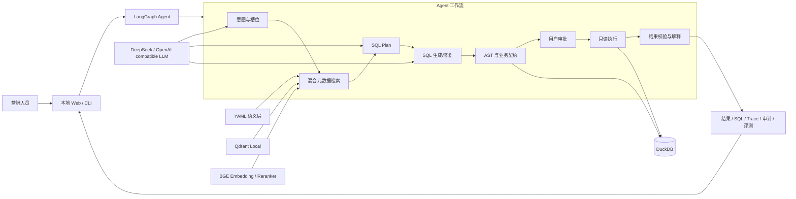

# 华泰证券 Agentic 智能问数项目技术文档

> 文档版本：v1.0  
> 整理日期：2026-08-02  
>
> 适用范围：当前项目工作区的 M6 MVP 及检索重排增量  
> 目标读者：开发、测试、数据治理、运维、评审与后续接手人员

## 一、系统定位

本系统是面向证券客户营销场景的 Text-to-SQL Agent。它将自然语言问题转换为受业务语义和安全规则约束的 SQL，在 DuckDB 上只读执行，并返回结果、解释和完整 Trace。

系统采用“单主 Agent + 确定性工具节点”设计。大模型承担意图理解、槽位补全、SQL Plan、SQL 生成/修复和结果解释；检索、SQL 校验、数据库执行、结果契约判断和评测使用确定性代码。

当前系统提供：

- 7 条官方样例的稳定 `demo` 路径。
- 面向开放问题的 `llm` 路径。
- CLI、Web 和离线评测三类入口。
- SQL 生成后人工确认、执行前二次校验的 Web 主链路。

## 二、总体架构



### 2.1 架构分层

| 层级 | 组件 | 职责 |
|---|---|---|
| 交互层 | 标准库 HTTP Server、原生 HTML/CSS/JS、CLI | 输入、审批和结果展示 |
| 编排层 | LangGraph、`QueryAgent`、`AgentState` | 节点顺序、条件路由、重试和状态 |
| 模型层 | OpenAI-compatible Client、Prompt、Generator | 结构化 LLM 调用 |
| 语义检索层 | YAML、关键词、Qdrant、Embedding、RRF、Reranker | 召回业务上下文 |
| 契约安全层 | `sqlglot`、业务规则 | SQL 和结果确定性校验 |
| 执行层 | `SqlExecutor`、`DuckDBExecutor` | 只读执行和结果封装 |
| 评测层 | 标准 SQL、81 题评测集、报告与 Manifest | 回归、对比和根因分析 |

## 三、技术栈

| 技术 | 用途 |
|---|---|
| Python 3.11+ | 主开发语言 |
| LangGraph / LangChain Core | Agent 状态图与消息抽象 |
| DeepSeek/OpenAI-compatible API | LLM 调用 |
| DuckDB | 本地分析型数据库 |
| Qdrant Client Local | 本地向量索引 |
| sentence-transformers | 本地 BGE Embedding 和 Cross-Encoder |
| sqlglot | DuckDB SQL AST、Scope 和契约校验 |
| PyYAML | 元数据与评测用例加载 |
| Pydantic | 结构化数据依赖 |
| 标准库 HTTP Server | 本地演示服务 |

项目依赖见 `huatai_query_agent/requirements.txt`。该文件未包含 `pytest`；测试可直接使用标准库 `unittest`。

## 四、目录结构

```text
huatai_query_agent/
  agent/
    graph.py                 QueryAgent、LangGraph 状态图与路由
    state.py                 AgentState 和 Trace
    contracts.py             SQL/输出/业务契约
    demo_cases.py            官方样例仓库
    nodes/m1_nodes.py        19 个功能节点
  data/
    cust_data.duckdb         本地数据库
    import_db.py             CSV 入库
    validate_db.py           数据库校验
  evaluation/                评测器、用例、报告、Manifest、A/B 实验
  executors/                 Executor 协议和 DuckDB 实现
  llm/                       配置、客户端、Prompt、SQL Generator
  metadata/                  5 类 YAML 业务语义资产
  retrieval/                 Chunk、Embedding、Qdrant、RRF、Reranker
  sql/                       7 条官方 DuckDB SQL
  tests/                     57 个单元测试方法
  vectorstore/qdrant/        本地向量索引
  web/server.py              Web 后端和单页前端
```

## 五、数据层设计

### 5.1 数据表

| 表 | 层级 | 主体 | 行数 | 日期范围 |
|---|---|---|---:|---|
| `ads_cust_info_d` | ADS | 客户画像 | 500 | 20260531 |
| `dws_cust_aset_d` | DWS | 客户资产 | 43,684 | 20260101-20260331 |
| `dws_cust_fin_d` | DWS | 资金流 | 4,892 | 20260105-20260331 |
| `dwd_cust_hold_d` | DWD | 客户持仓 | 408,150 | 20260101-20260331 |
| `dwd_cust_tran_d` | DWD | 客户交易 | 39,060 | 20260105-20260331 |
| `dim_product` | DIM | 产品维度 | 334,694 | 静态维表 |
| `dim_branch` | DIM | 机构维度 | 312 | 20260531 |
| `dim_public` | DIM | 公共编码 | 155 | 静态维表 |

### 5.2 主要关联

- 客户与资产、资金、持仓、交易均通过 `pty_id` 关联。
- 持仓和交易通过 `prdt_id` 关联产品维表。
- 客户通过组织字段关联营业部维表。
- 字典表用于客户等级、性别、学历、账户状态、币种等编码翻译。

多事实表存在多行时，契约要求先在各自 CTE 中按目标粒度预聚合，再进行连接，避免直接 JOIN 导致乘法放大。

### 5.3 数据导入与校验

```powershell
E:\anaconda\envs\huatai-agent\python.exe huatai_query_agent\data\import_db.py
E:\anaconda\envs\huatai-agent\python.exe huatai_query_agent\data\validate_db.py
```

执行器每次使用 `duckdb.connect(..., read_only=True)` 打开连接，执行结束后关闭。

## 六、元数据与检索

### 6.1 元数据文件

| 文件 | 内容 |
|---|---|
| `schema_catalog.yaml` | 8 表、68 字段、类型、含义和日期范围 |
| `business_terms.yaml` | 术语、别名、代码映射和产品消歧 |
| `metrics.yaml` | 11 个指标公式及口径 |
| `relationships.yaml` | 12 个关系/关联模式 |
| `query_examples.yaml` | 7 个官方样例的场景、意图和输出契约 |

`MetadataChunkBuilder` 当前生成 143 个可检索 chunk：8 table、68 field、40 term、11 metric、4 time_period、12 relationship。官方样例不生成 `example_sql` chunk，防止标准答案进入开放式检索上下文。

### 6.2 检索流程

```text
查询文本
  -> YAML 精确匹配
  -> 关键词候选 Top(3K)
  -> Qdrant 向量候选 Top(3K)
  -> RRF 融合，k=60
  -> 精确结果置顶
  -> 非精确 Top K 内 Cross-Encoder 名次融合
  -> 去重并输出 Top K（Agent 默认 16）
```

RRF 分数：

```text
rrf_score(d) = Σ 1 / (60 + rank_source(d))
```

当前重排分数：

```text
final_score(d) = rrf_score(d) + 0.5 / (60 + cross_encoder_rank(d))
```

Cross-Encoder 原始 logit 不直接与关键词或向量分数相加，只使用其名次贡献；精确命中不参与重排。

### 6.3 Embedding 后端

支持：

- `HashingEmbedding`：384 维确定性本地兜底，不是真正语义模型。
- `SentenceTransformersEmbedding`：当前可使用本地 `bge-small-zh-v1.5`。
- `OpenAICompatibleEmbedding`：用于本地 bge-m3 等兼容服务。

环境未显式指定时，若安装了 `sentence-transformers`，当前代码优先使用本地 SentenceTransformer；否则回退 hashing。更换 Embedding 模型或向量维度后必须重建 Qdrant 索引。

### 6.4 Reranker

默认实现为本地 `BAAI/bge-reranker-base`：

- 懒加载模型。
- 默认 batch size 8、最大长度 512、融合权重 0.5。
- `fail_open=true` 时推理失败保留 RRF 顺序并记录 fallback。
- CPU 热启动约 2.20 秒/题，延迟敏感场景可禁用。

### 6.5 Qdrant Local 边界

Qdrant Local 使用目录锁，同一索引目录不能被多个进程并发打开。CLI、Web 和评测并行运行时可能出现 `AlreadyLocked`。开发测试应使用独立临时索引；服务化部署应改用 Qdrant Server。

重建索引：

```powershell
E:\anaconda\envs\huatai-agent\python.exe -m huatai_query_agent.retrieval.build_vector_index
```

## 七、Agent 状态与工作流

### 7.1 AgentState

主要状态分组如下：

| 分组 | 代表字段 |
|---|---|
| 请求 | `thread_id`、`query_id`、`question`、`sql_mode` |
| 理解 | `normalized_question`、`intent`、`missing_slots`、`assumptions` |
| 记忆 | `is_followup`、`thread_summary`、`followup_patch` |
| 检索 | `metadata_context`、`context_ids` |
| 生成 | `sql_plan`、`candidate_sql`、`sql_generation_attempts` |
| 校验执行 | `validation_report`、`execution_result`、`result_check` |
| 控制 | `retry_count`、`max_retries`、`next_action`、`case_timed_out` |
| 输出审计 | `final_answer`、`confidence`、`trace`、`audit_record` |
| LLM 记录 | `llm_intent`、`llm_slot_fill`、`llm_plan`、`llm_generation`、`llm_repair` |

每个节点通过 `add_trace()` 追加节点名、状态、消息、时间戳和附加信息。

### 7.2 19 个功能节点

| 顺序 | 节点 | 作用 |
|---:|---|---|
| 1 | `init_run` | 初始化运行 Trace |
| 2 | `load_thread_context` | 恢复短期摘要 |
| 3 | `normalize_question` | 清理问题文本 |
| 4 | `detect_followup` | 识别追问和机构条件修改 |
| 5 | `parse_intent` | Demo 匹配或 LLM 意图解析 |
| 6 | `retrieve_metadata` | 构建 Top 16 元数据上下文 |
| 7 | `fill_slots` | LLM 槽位补全 |
| 8 | `check_intent_slots` | 区分阻断项、假设和非阻断不确定性 |
| 9 | `resolve_product` | 产品名称消歧 |
| 10 | `plan_sql` | 生成并补强结构化 SQL Plan |
| 11 | `generate_sql` | 标准 SQL 或 LLM SQL |
| 12 | `validate_sql` | AST 与业务契约校验 |
| 13 | `execute_sql` | DuckDB 只读执行 |
| 14 | `validate_result` | 结果字段、行数和空结果校验 |
| 15 | `repair_sql` | LLM 定向修复，默认最多 2 次 |
| 16 | `ask_clarification` | 请求补充关键口径 |
| 17 | `human_review_or_explain` | 失败、超时或低置信转人工 |
| 18 | `render_answer` | LLM 或确定性结果说明 |
| 19 | `persist_state` | 保存进程内 thread 摘要 |

### 7.3 关键路由

- 阻断槽位存在：`ask_clarification`。
- 产品名有歧义：`ask_clarification`。
- SQL 校验失败且未超过重试次数：`repair_sql`。
- 执行失败且可重试：`repair_sql`。
- 结果校验通过且置信度不低于 0.5：`render_answer`。
- 超时、无 SQL、多次修复失败：`human_review_or_explain`。

当 LangGraph 不可用时，`QueryAgent` 提供等价的顺序 fallback；Web 的 `prepare()` 本身也使用准备阶段 fallback，在数据库连接前停止。

### 7.4 Demo 与 LLM 模式

`demo` 模式：

- 将问题匹配到 q001-q007。
- 使用已确认标准 SQL。
- 仍经过检索、SQL 校验、真实执行和结果校验。

`llm` 模式：

- 允许没有匹配官方样例的自然语言问题。
- 依次调用意图、槽位、计划、生成、修复和解释能力。
- 所有模型输出要求 JSON object。
- LLM 失败、超时或没有 SQL 时不执行数据库。

## 八、LLM 接入

### 8.1 配置

`LlmSettings` 从项目 `.env` 和进程环境读取：

```text
HUATAI_LLM_PROVIDER
HUATAI_LLM_BASE_URL
HUATAI_LLM_MODEL
HUATAI_LLM_API_KEY
HUATAI_LLM_TIMEOUT_SECONDS
HUATAI_LLM_TEMPERATURE
HUATAI_LLM_MAX_TOKENS
```

云端地址必须配置 API Key；localhost、内网地址可使用本地占位 Key。

### 8.2 调用与输出

客户端调用 `chat.completions.create()`，设置：

- `response_format={"type": "json_object"}`。
- 默认温度 0。
- OpenAI SDK 自动重试为 0，由 Agent 控制修复路径。
- 记录模型、Token、开始/结束时间和耗时。

### 8.3 单题超时

`case_deadline()` 使用 ContextVar 保存单题截止时间。发起 LLM 请求前预留 5 秒收尾时间，并将请求超时限制为“模型默认超时”和“单题剩余时间”中的较小值。超时进入 `case_timeout`，不会继续发起下一阶段调用。

### 8.4 隐私

使用云端 LLM 时，问题、元数据上下文、SQL Plan 和结果摘要可能发送给供应商。Web 会要求调用方显式确认 `allow_cloud_llm`；金融生产环境应使用经审批的本地模型网关。

## 九、SQL Plan 与业务契约

SQL Plan 不只是表名和指标，还可包含：

```json
{
  "tables": [],
  "metrics": [],
  "output_columns": [],
  "population": "",
  "grain": [],
  "snapshot_policy": {},
  "eligibility_filters": [],
  "missing_fact_policy": {},
  "missing_period_policy": {},
  "window": [],
  "order_by": [],
  "top_n": null,
  "join_contract": [],
  "dictionary_translation": true,
  "expect_nonempty": false
}
```

`_enrich_sql_plan()` 按请求契约、官方样例契约、意图和元数据补齐字段，并为单日快照表自动加入日期政策。

## 十、SQL 安全围栏

### 10.1 基础安全

1. SQL 非空。
2. 只允许 `SELECT` 或 `WITH` 开头。
3. 禁止 `INSERT/UPDATE/DELETE/DROP/ALTER/TRUNCATE/CREATE/COPY/ATTACH/DETACH/PRAGMA`。
4. `sqlglot` 解析后必须只有一条语句。

### 10.2 元数据与 Scope

- 校验物理表是否在 8 表白名单中。
- 校验字段是否属于对应表或 CTE 投影。
- 使用 sqlglot Scope 处理 CTE、别名和 `SELECT *` 展开。

### 10.3 业务契约

- 快照日期与表级日期范围。
- 输出列缺失、多余、顺序和别名。
- 编码字段到业务名称的字典翻译。
- 窗口函数、分区、排序和 tie-breaker。
- JOIN 类型。
- 多事实表预聚合。
- 缺失事实记录与数值 0 的区别。
- 缺失期间是否允许补齐。
- Top N 前的资格条件与分组排名。
- 无依据新增过滤告警。

### 10.4 指标公式

当前确定性检查覆盖：

- 总资产：`nm_tot_aset + fc_pur_aset`。
- 日均资产：普通及信用资产，并按声明口径求平均。
- 交易金额/换手额：`buy_amt + sell_amt`。
- 总费用：买卖佣金与规费字段。
- 净流入：三类流入减三类流出。
- 持仓市值：`mkt_val`。
- 资产流入、资产流出。
- 区间盈亏：期末资产 - 期初资产 + 流出 - 流入。

### 10.5 校验输出

`validation_report` 包含：

- `passed`。
- 分项 `checks`。
- `referenced_tables`。
- 投影明细。
- `errors` 和 `warnings`。

失败会进入 SQL repair；达到最大次数后进入人工复核。

## 十一、执行与结果校验

`DuckDBExecutor.execute()` 返回：

```text
success, columns, rows, row_count, preview_rows, elapsed_ms, error
```

写入 AgentState 时只保留预览行，降低前端返回体积；执行器内部当前仍使用 `fetchall()`，所以生产化前必须增加默认 LIMIT、分页或流式读取。

结果校验包括：

- SQL 是否执行成功。
- 预期非空时是否返回 0 行。
- 非窗口 Top N 是否超过计划行数。
- 实际输出字段是否与 SQL Plan 契约完全一致。

## 十二、SQL 审批链路

Web 主链路分为两步：

1. `/api/query/prepare`：完成理解、检索、计划、生成和 SQL 校验，不连接数据库；校验通过后生成内存执行令牌。
2. `/api/query/execute`：消费一次性令牌，对相同 SQL 再次校验，然后只读执行和结果验证。

令牌默认 30 分钟过期、仅可使用一次，并存储在当前进程内。服务重启后失效。

系统仍保留兼容接口 `/api/query`，该接口会直接完成执行。生产部署应禁用它或在服务层强制加入审批策略，不能只依赖前端调用顺序。

## 十三、会话与记忆

`QueryAgent` 按 `thread_id` 保存内存摘要，包括上一问题、意图、SQL Plan、SQL、上下文 ID 和结果列信息。当前追问能力主要支持“只看/改成某分公司或营业部”等条件补丁。

边界：

- 不是持久化 LangGraph checkpoint。
- 进程重启后丢失。
- 不保存完整客户结果作为长期知识。
- 评测时使用独立 thread ID，避免用例之间上下文污染。

## 十四、Web API

| 方法 | 路径 | 作用 |
|---|---|---|
| GET | `/` | 单页工作台 |
| GET | `/api/health` | 系统、LangGraph、模型配置和样例数 |
| GET | `/api/examples` | 7 个官方样例 |
| GET | `/api/llm/health` | 检查模型列表和配置模型 |
| POST | `/api/query/prepare` | 生成并校验 SQL |
| POST | `/api/query/execute` | 审批后执行 |
| POST | `/api/query` | 兼容的一步执行接口 |

Web 使用 `ThreadingHTTPServer`，没有身份认证、权限模型、CSRF、防刷和 TLS，默认只应绑定 `127.0.0.1`。

启动：

```powershell
E:\anaconda\envs\huatai-agent\python.exe -m huatai_query_agent.web.server --host 127.0.0.1 --port 8501
```

## 十五、自动化评测

### 15.1 用例分层

| 集合 | 数量 | 目的 |
|---|---:|---|
| official | 7 | 比赛官方场景 |
| extended | 14 | 同义表达与条件变体 |
| synthetic | 30 | 常见营销组合 |
| advanced | 30 | 长问题、窗口、多事实表和复杂契约 |
| 合计 | 81 | 完整 LLM 能力基线 |

### 15.2 评测方法

每题执行：

```text
标准 SQL -> DuckDB
Agent -> 候选 SQL -> 围栏/执行
两侧结果 -> 列契约与语义对齐 -> 指标和错误标签
```

主要指标：

- `agent_completed`。
- `candidate_executable`。
- 严格/语义字段匹配。
- 行数匹配。
- 有序/无序语义值匹配。
- 严格精确匹配。
- LLM 调用数、Token、耗时和错误标签。

### 15.3 报告产物

- Markdown 报告。
- CSV 逐题结果。
- JSON Manifest：运行配置、版本、哈希、线程和汇总。
- JSONL SQL 生成事件。
- 根因分析和快速回归套件。

### 15.4 关键命令

```powershell
# 7 条标准 SQL
E:\anaconda\envs\huatai-agent\python.exe huatai_query_agent\evaluation\run_demo_queries.py --preview 2

# Demo Agent 评测
E:\anaconda\envs\huatai-agent\python.exe huatai_query_agent\evaluation\run_agent_eval.py --sql-mode demo --strict-result-match

# 完整 LLM 评测
E:\anaconda\envs\huatai-agent\python.exe huatai_query_agent\evaluation\run_agent_eval.py --case-set all --sql-mode llm

# 60 道合成/高级参考 SQL 校验
E:\anaconda\envs\huatai-agent\python.exe huatai_query_agent\evaluation\validate_case_sql.py --case-set all --require-non-empty

# 围栏评测（会重写报告文件）
E:\anaconda\envs\huatai-agent\python.exe huatai_query_agent\evaluation\run_guardrail_eval.py
```

完整 LLM 评测会产生大量模型调用；归档 81 题运行消耗约 230 万 Token 和 2 小时 23 分钟，应先运行小型回归套件。

## 十六、配置项

| 类别 | 关键环境变量 |
|---|---|
| LLM | `HUATAI_LLM_PROVIDER/BASE_URL/MODEL/API_KEY/TIMEOUT_SECONDS/MAX_TOKENS` |
| Embedding | `HUATAI_EMBEDDING_PROVIDER/MODEL/BASE_URL/VECTOR_SIZE/NORMALIZE` |
| Reranker | `HUATAI_RERANKER_PROVIDER/MODEL/BATCH_SIZE/MAX_LENGTH/DEVICE/FAIL_OPEN/FUSION_WEIGHT` |
| Web | `HUATAI_WEB_HOST/PORT/CASE_TIMEOUT_SECONDS` |
| 评测审计 | `HUATAI_LIVE_SQL_EVENTS_PATH` |

私密配置存入 `.env`，不得提交。公开模板为 `.env.example`。

## 十七、测试与本次核验

运行单元测试：

```powershell
E:\anaconda\envs\huatai-agent\python.exe -m unittest discover -s huatai_query_agent\tests -p "test_*.py" -v
```

2026-08-02 核验结果：

| 项目 | 结果 |
|---|---|
| 数据库 8 表结构/行数 | 通过，共 831,447 行 |
| 关键数据冒烟查询 | 通过 |
| 7 条官方标准 SQL | 7/7 执行成功 |
| 60 条合成/高级参考 SQL | 60/60 可执行、非空、字段契约一致 |
| 单元测试 | 51 项通过；6 项因 Qdrant 文件锁未执行 |
| Web 健康接口 | 正常，LangGraph 可用，7 个样例 |
| 当前围栏期望匹配 | 9/10；安全正例缺快照日期导致契约漂移 |

## 十八、已知问题与生产化要求

1. 完整 LLM 归档严格结果匹配仅 6.17%，必须完成当前增强后的全量重跑。
2. Qdrant Local 不支持多个进程共享同一目录。
3. Web 服务仅为本地 Demo，无认证授权和生产级网络防护。
4. 一步执行 API 仍可绕过前端审批交互。
5. DuckDB 适合本地 PoC，不是多用户企业数仓替代品。
6. Executor 使用 `fetchall()`，大结果集可能占用过多内存。
7. 会话、审批令牌和 Agent 实例都在进程内，缺少持久化和多实例一致性。
8. Reranker CPU 延迟较高，需按场景选择启用或异步化。
9. 元数据当前仅定义 11 个指标，业务覆盖仍有限。
10. 云端 LLM 存在数据外发风险。

生产演进建议：接入企业数仓和数据目录、Qdrant Server、本地模型网关、IAM/RBAC、查询配额、SQL 成本控制、分页、持久化 checkpoint、集中审计、CI/CD 和灰度回滚。

## 十九、故障排查

| 现象 | 常见原因 | 处理 |
|---|---|---|
| `No module named pytest` | 推荐环境未安装 pytest | 使用 `unittest` 或补充开发依赖 |
| `Qdrant ... AlreadyLocked` | Web/CLI/评测共用 Local 目录 | 关闭占用进程、改临时路径或使用 Qdrant Server |
| 向量维度不匹配 | 更换 Embedding 未重建索引 | 重建 Qdrant 索引 |
| LLM 无法连接 | Base URL、Key、代理或网络权限问题 | 运行 `llm/check_connection.py` |
| SQL 通过语法但被拦截 | 快照、输出列或业务契约不满足 | 查看 `validation_report.errors` |
| 完整问题被澄清 | 槽位被判为阻断 | 检查 `blocking_missing_slots` 与原问题 |
| Web 执行令牌失效 | 超过 30 分钟、已使用或服务重启 | 重新生成并审批 SQL |

## 二十、参考文档

- `00_PRD_产品需求文档.md`
- `01_元数据与业务术语映射文档.md`
- `02_技术实现方案文档.md`
- `03_DuckDB数据库选型调研文档.md`
- `04_RAG向量数据库选型调研文档.md`
- `05_Data_Stream_Report_数据流转报告.md`
- `06_Demo_Runbook_答辩演示脚本.md`
- `07_PPT汇报项目文档.md`
- `08_项目成果总结.md`

